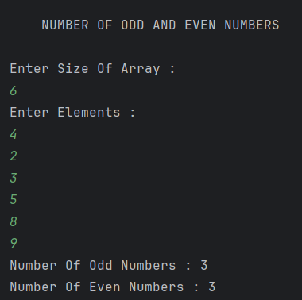

# Count Odd and Even Numbers in an Array

A simple Java program that reads an array of integers and counts how many odd and even numbers are present using basic array traversal and conditional logic.

---

## 📂 Files
- `Main.java`

---

## 🧠 Concept Used
- Arrays
- For loops
- Conditional statements (`if-else`)
- Modulus operator (`%`)
- Scanner class for input handling

---

## 📸 Screenshot

---

## 👨‍💻 Author

**Sujal Patil**

  
  

