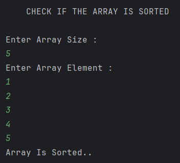

# Check if an Array Is Sorted

A Java program that checks whether a given integer array is sorted in non-decreasing (ascending) order using a single-pass validation approach.

---

## 📂 Files
- `Main.java`

---

## 🧠 Concept Used
- Arrays
- Linear traversal
- Boolean flag validation
- Early loop termination (`break`)
- Time Complexity: **O(n)**
- Space Complexity: **O(1)**

---

## 📸 Screenshot

---

## 👨‍💻 Author

**Sujal Patil**

  
  

