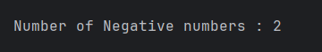

# Count Negative Numbers in an Array

## 📌 Problem Statement
Given an integer array, count how many elements in the array are **negative numbers**.

---

## 🧠 Approach
- Initialize a counter to track negative numbers.
- Traverse the array using a loop.
- For each element:
  - If the value is less than `0`, increment the counter.
- Display the final count.

---

## 📤 Output

---

## ⏱ Time and Space Complexity
- **Time Complexity:** O(n)
- **Space Complexity:** O(1)

---

## 🏷 Category
- Data Structures and Algorithms  
- Arrays  
- Counting Problems  

---

## 👨‍💻 Author

**Sujal Patil**

  
  

---

## ✅ Key Takeaway
This problem builds a strong foundation in array traversal and conditional logic—core skills required for coding interviews and competitive programming.

