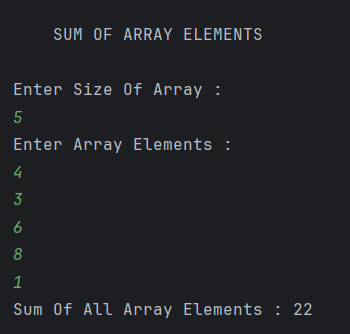

# Sum of Array Elements (Java)

A simple Java program that reads an array from user input and calculates the sum of all its elements using iterative logic.

---

## 📂 Files
- `Main.java`

---

## 🧠 Concept Used
- Arrays
- `for` loop iteration
- User input using `Scanner`
- Accumulator pattern (sum)

---

## 📸 Screenshot

---

## 👨‍💻 Author
**Sujal Patil**

  
  

