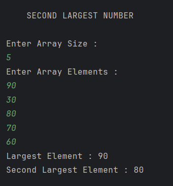

# Second Largest Element in an Array

A Java program that determines the largest and second largest elements in an integer array using a single traversal approach.

---

## 📂 Files
- `Main.java`

---

## 🧠 Concept Used
- Arrays
- Single-pass traversal
- Conditional comparisons
- Time Complexity: **O(n)**
- Space Complexity: **O(1)**

---

## 📸 Screenshot

---

## 👨‍💻 Author

**Sujal Patil**

  
  

