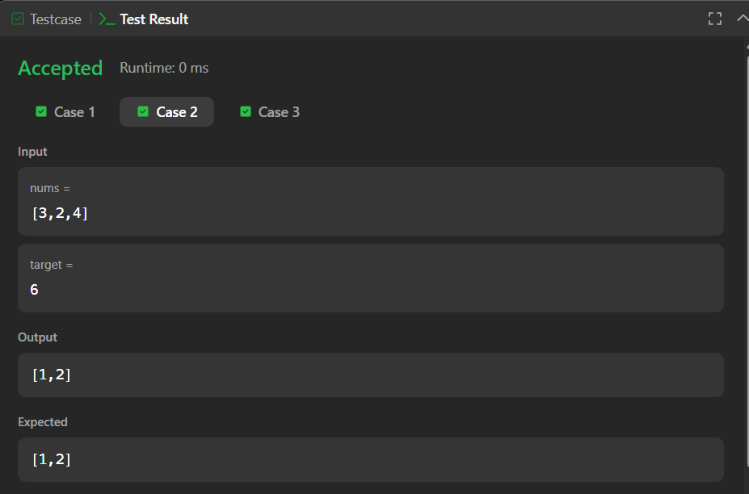
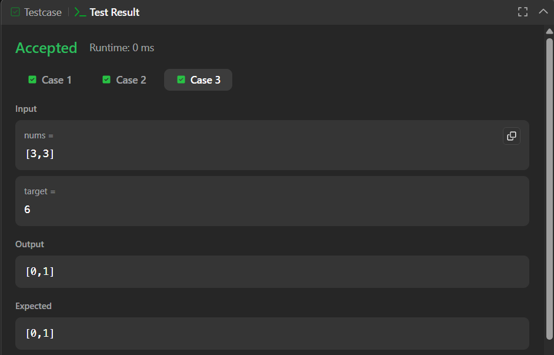

# Two Sum (Brute Force)

A simple Java implementation of the classic Two Sum problem using a brute-force approach to find two indices whose values add up to a given target.

---

## 📂 Files
- `Solution.java`

---

## 🧠 Concept Used
- Arrays
- Nested loops
- Brute-force search
- Index-based comparison

---

## 📸 Screenshot
  
  

---

## 👨‍💻 Author

**Sujal Patil**

  
  

