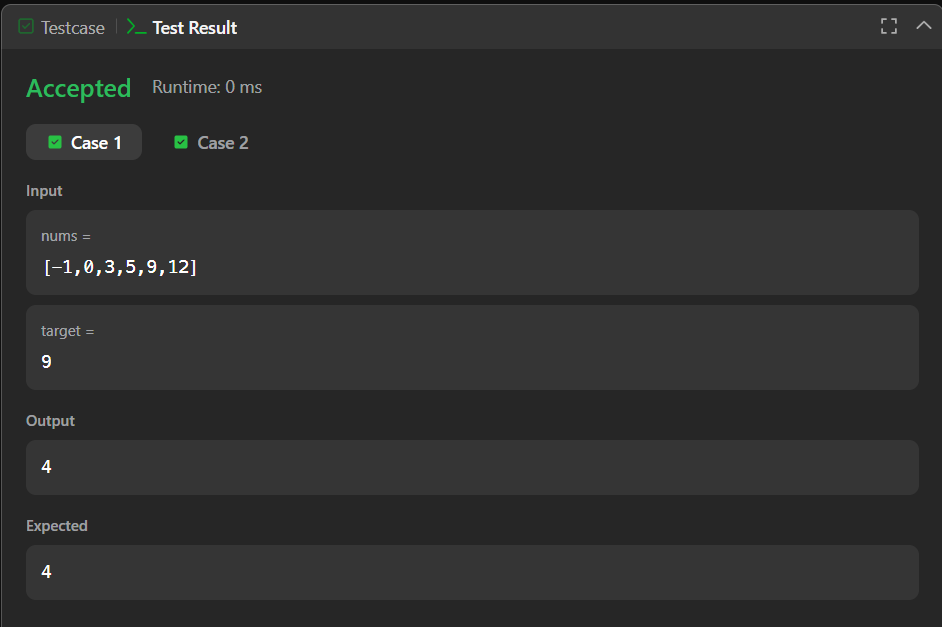
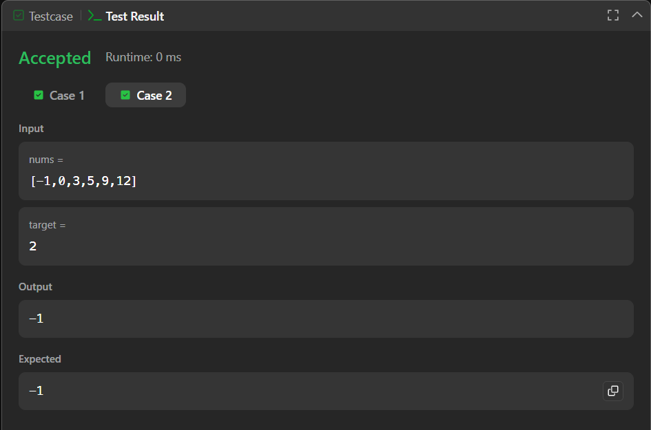

# Binary Search – LeetCode (Java)

Java solution for the **Binary Search** problem on LeetCode, implemented using an iterative approach.

---

## 📂 Files
- `Solution.java`

---

## 🧠 Concept Used
- Binary Search
- Iterative algorithm
- Time Complexity: **O(log n)**
- Space Complexity: **O(1)**

---

## 🧩 Problem Source
- Platform: **LeetCode**
- Problem: Binary Search  
- Approach: Standard binary search on a sorted array

---

## 📸 Screenshot
  

---

## 👨‍💻 Author

**Sujal Patil**

