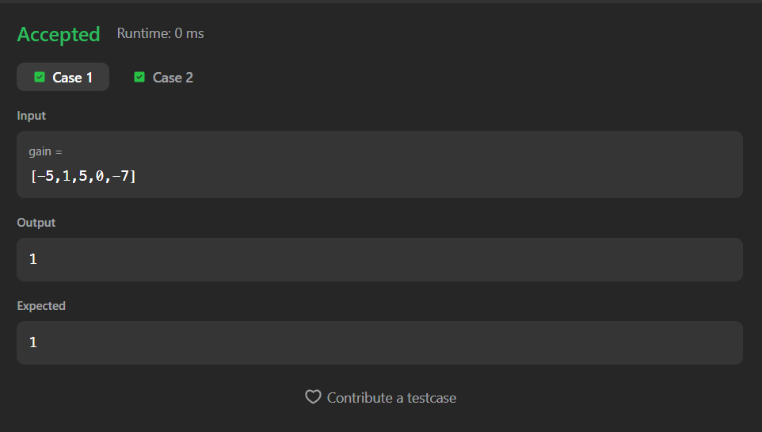
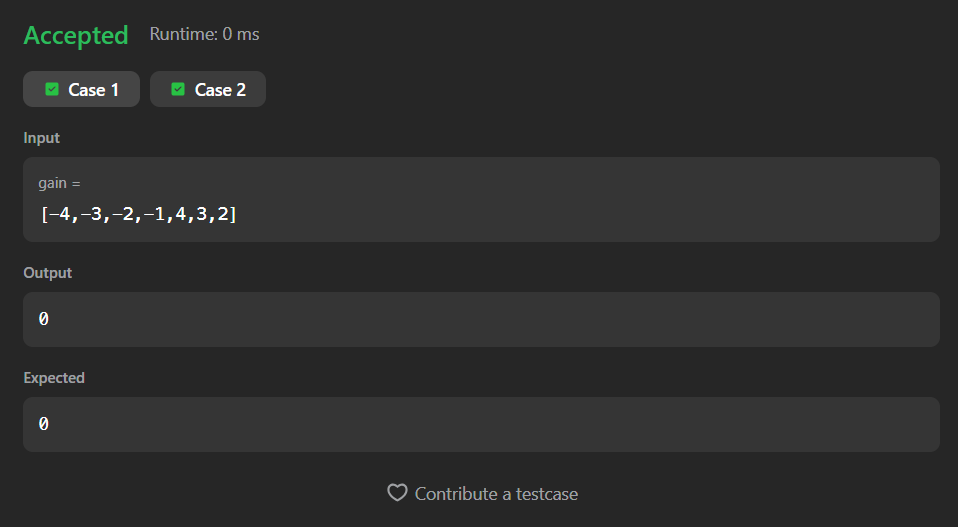

# 1389. Create Target Array in the Given Order

A Java solution to the LeetCode problem **Create Target Array in the Given Order**, where elements from the `nums` array are inserted into a target array at the positions specified by the `index` array.

The solution uses an **ArrayList** to support dynamic index-based insertion and then converts it back to an array.

---

## 📂 Files
- `Solution.java`

---

## 🧠 Concept Used
- Arrays
- ArrayList
- Index-based insertion
- Dynamic array resizing  
- Time Complexity: **O(n²)**  
- Space Complexity: **O(n)**

---

## Screenshot

### Test Case 1

### Test Case 2

### Test Case 3

---

## 👨‍💻 Author

**Sujal Patil**

  
  

