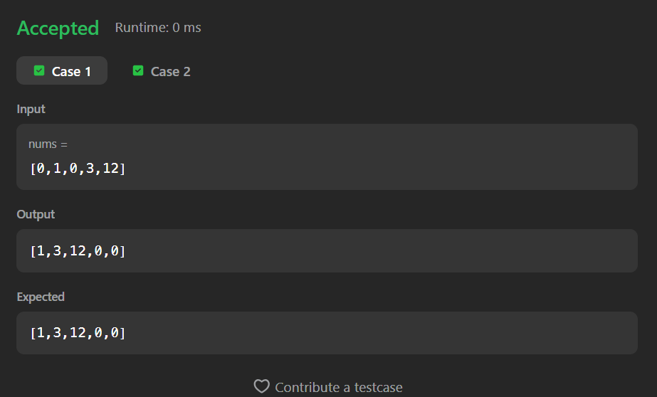

# 283. Move Zeroes

A Java solution to the LeetCode problem **Move Zeroes**, where all `0`s in the array are moved to the end while maintaining the **relative order of non-zero elements**.

The solution uses a **two-pointer technique** to rearrange elements efficiently in-place.

---

## 📂 Files
- `Solution.java`

---

## 🧠 Concept Used
- Arrays
- Two-pointer technique
- In-place modification
- Stable element ordering  
- Time Complexity: **O(n)**  
- Space Complexity: **O(1)**

---

## Screenshot

### Test Case 1

### Test Case 2

---

## 👨‍💻 Author

**Sujal Patil**

  
  

