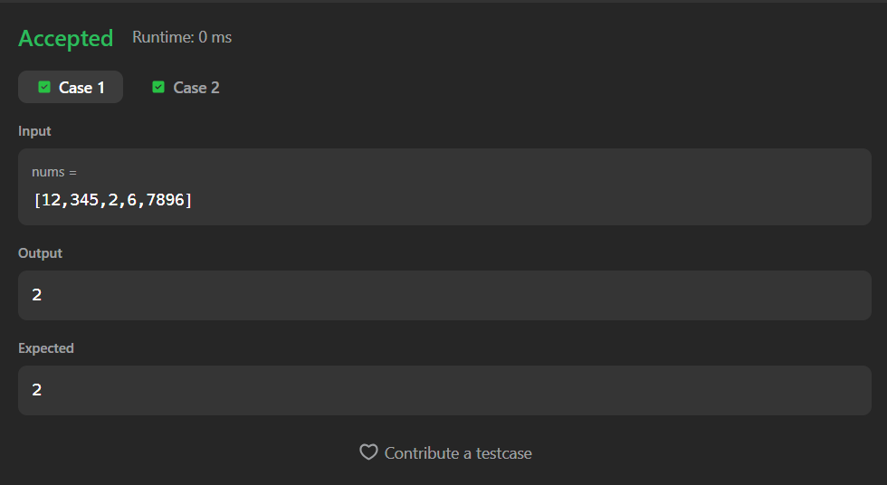
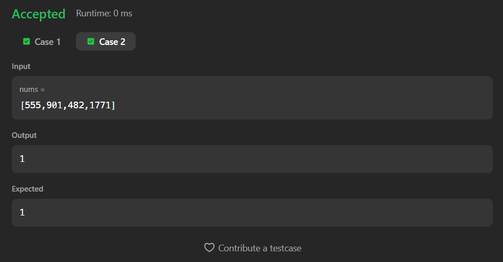

# 1295. Find Numbers with Even Number of Digits

A Java solution to the LeetCode problem **Find Numbers with Even Number of Digits**, where the task is to count how many numbers in the array contain an **even number of digits**.

The solution computes the digit count for each number using integer division and checks its parity.

---

## 📂 Files
- `Solution.java`

---

## 🧠 Concept Used
- Arrays
- Integer digit counting
- Modulus operation
- Linear traversal  
- Time Complexity: **O(n · d)** (where `d` is the number of digits)  
- Space Complexity: **O(1)**

---

## Screenshot

### Test Case 1

### Test Case 2

---

## 👨‍💻 Author

**Sujal Patil**

  
  

