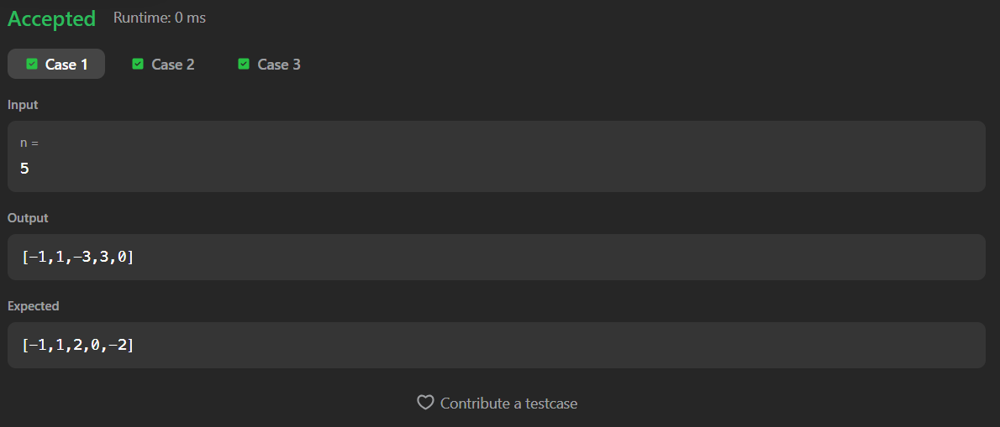

# 1304. Find N Unique Integers Sum up to Zero

A Java solution to the LeetCode problem **Find N Unique Integers Sum up to Zero**, where the task is to generate an array of `n` unique integers such that their sum equals `0`.

The solution constructs pairs of positive and negative integers and handles the odd-length case by including `0`.

---

## ⏱️ Execution Time
15 minutes 5 seconds

---

## 📂 Files
- `Solution.java`

---

## 🧠 Concept Used
- Arrays
- Pair-based number construction
- Handling even and odd length cases
- Loop control and index manipulation  
- Time Complexity: **O(n)**  
- Space Complexity: **O(n)**

---

## Screenshot

### Test Case

### Accepted Submission

---

## 👨‍💻 Author

**Sujal Patil**

  
  

