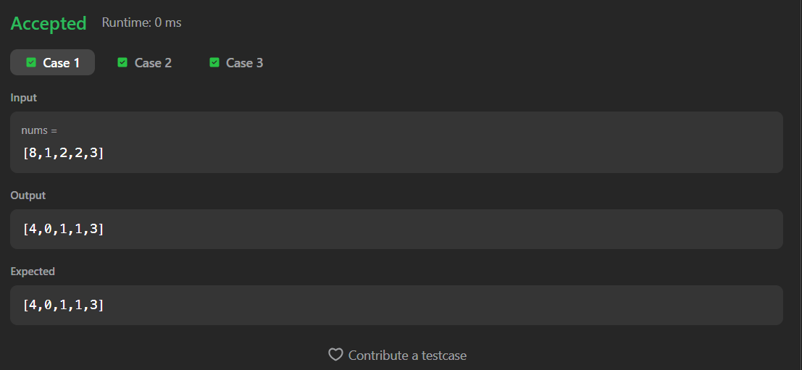
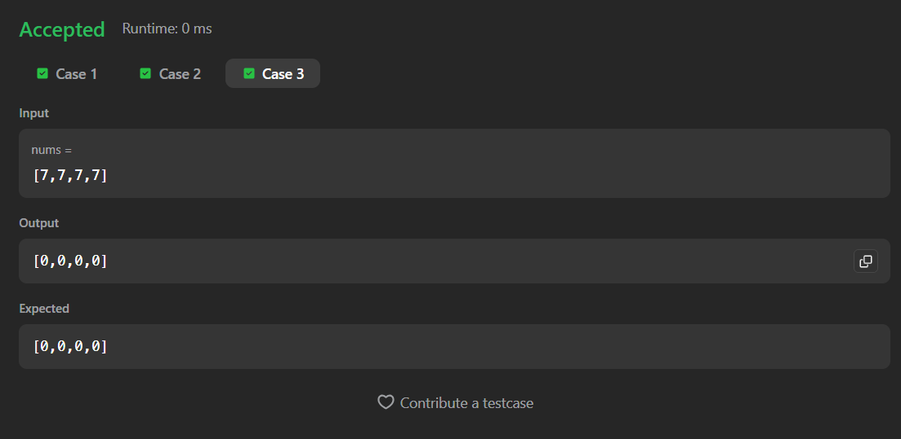

# 1365. How Many Numbers Are Smaller Than the Current Number

A Java solution to the LeetCode problem **How Many Numbers Are Smaller Than the Current Number**, where for each element in the array, we count how many numbers are strictly smaller than it.

This solution uses a **brute-force comparison approach** with nested loops to compute the result for each index.

---

## 📂 Files
- `Solution.java`

---

## 🧠 Concept Used
- Arrays
- Nested loops
- Element comparison
- Brute-force counting  
- Time Complexity: **O(n²)**  
- Space Complexity: **O(n)**

---

## Screenshot

### Test Case 1

### Test Case 2

### Test Case 3

---

## 👨‍💻 Author

**Sujal Patil**

  
  

