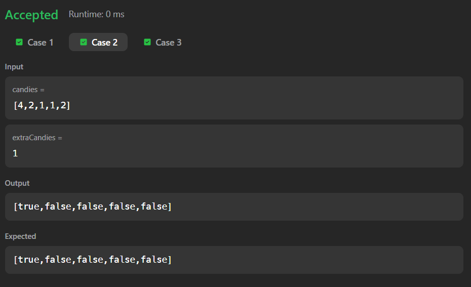
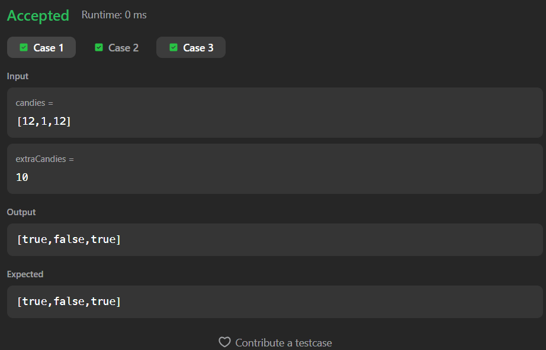

# 1431. Kids With the Greatest Number of Candies

A Java solution to the LeetCode problem **Kids With the Greatest Number of Candies**, where for each child we determine whether giving them all the extra candies will make their total candies **greater than or equal to** the maximum candies any child currently has.

---

## 📂 Files
- `Solution.java`

---

## 🧠 Concept Used
- Arrays
- Maximum value computation
- Conditional checks
- List construction (`ArrayList`)
- Two-pass traversal  
- Time Complexity: **O(n)**  
- Space Complexity: **O(n)**

---

## Screenshot

### Test Case 1

### Test Case 2

### Test Case 3

---

## 👨‍💻 Author

**Sujal Patil**

  
  

