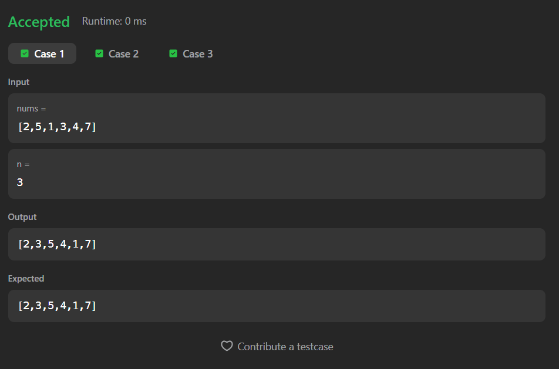
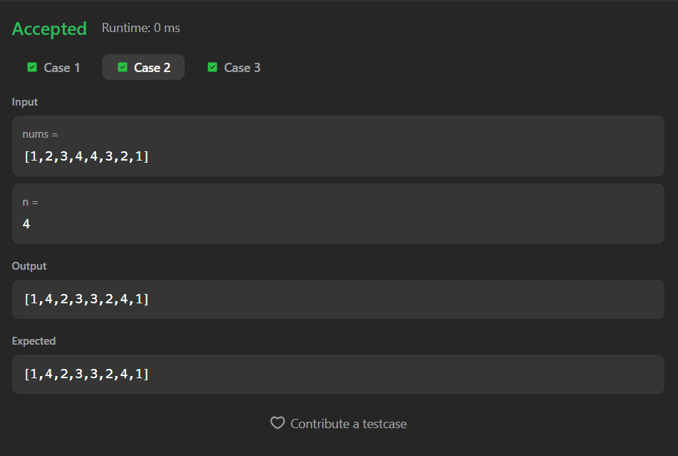
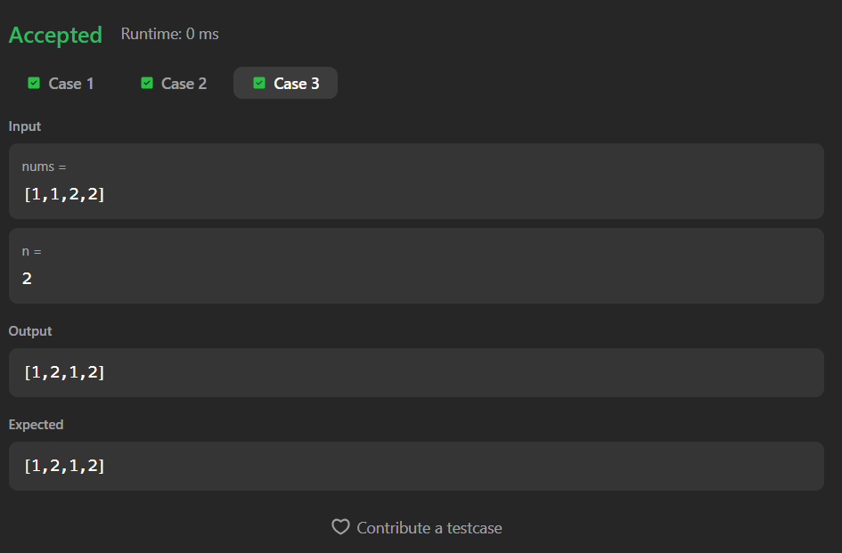

# 1470. Shuffle the Array

A Java solution to the LeetCode problem **Shuffle the Array**, where the given array is rearranged by interleaving the first `n` elements with the last `n` elements in alternating order.  
The solution uses index mapping with a single linear pass.

---

## 📂 Files
- `Solution.java`

---

## 🧠 Concept Used
- Arrays
- Index manipulation
- Two-pointer technique
- Linear traversal  
- Time Complexity: **O(n)**  
- Space Complexity: **O(n)**

---

## Screenshot

### Test Case 1

### Test Case 2

### Test Case 3

---

## 👨‍💻 Author

**Sujal Patil**

  
  

