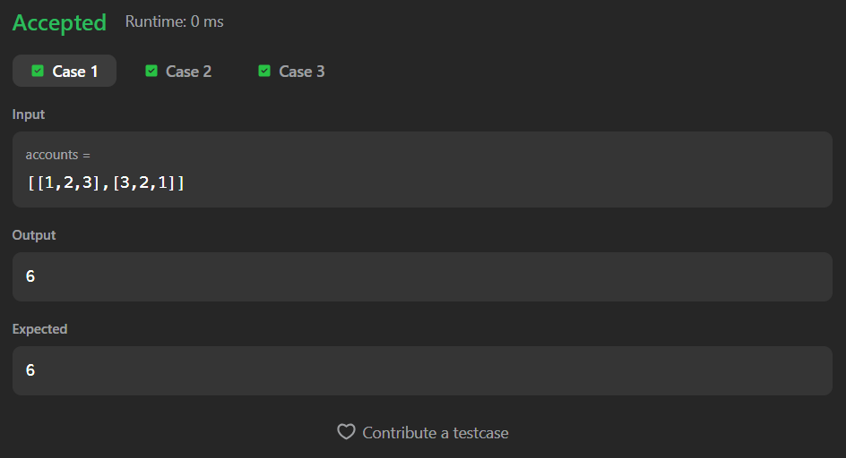

# 1672. Richest Customer Wealth

A Java solution to the LeetCode problem **Richest Customer Wealth**, where the task is to find the customer with the maximum total wealth by summing balances across multiple bank accounts.  
The solution uses efficient nested traversal with constant extra space.

---

## 📂 Files
- `Solution.java`

---

## 🧠 Concept Used
- 2D Arrays
- Nested loops
- Row-wise summation
- Maximum value tracking  
- Time Complexity: **O(m × n)**  
- Space Complexity: **O(1)**

---

## Screenshot

### Test Case 1

### Test Case 2

### Test Case 3

---

## 👨‍💻 Author

**Sujal Patil**

  
  

