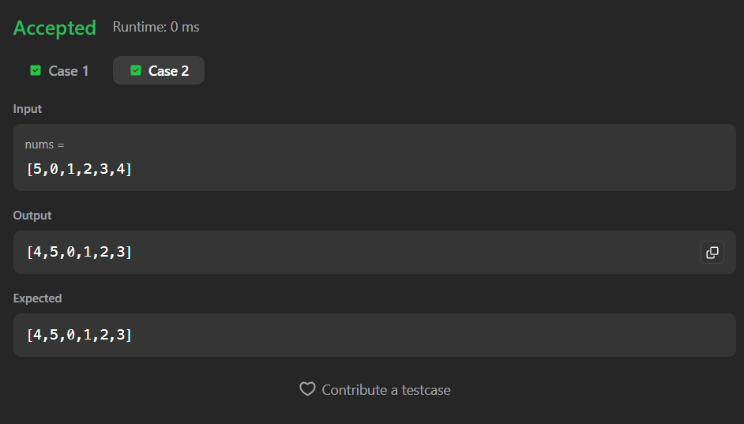

# Build Array from Permutation (LeetCode 1920)

Efficient array-mapping solution to construct a new array where each element is formed using index-based permutation. Achieves **O(n)** time complexity.

---

## 📂 Files
- `Solution.java`

---

## 🧠 Concept Used
- Array Index Mapping  
- One-Pass Traversal  
- Direct Index Access  
- Linear Time Complexity  

---

## 🚀 Approach
- Create a new array `ans` of same size as `nums`
- Traverse the array  
- For each index `i`, assign:  
  `ans[i] = nums[nums[i]]`
- Return the constructed array

---

## ⏱ Complexity
- **Time:** O(n)  
- **Space:** O(n)

---

## 📸 Screenshot
  

---

## 👨‍💻 Author
**Sujal Patil**

  
  

