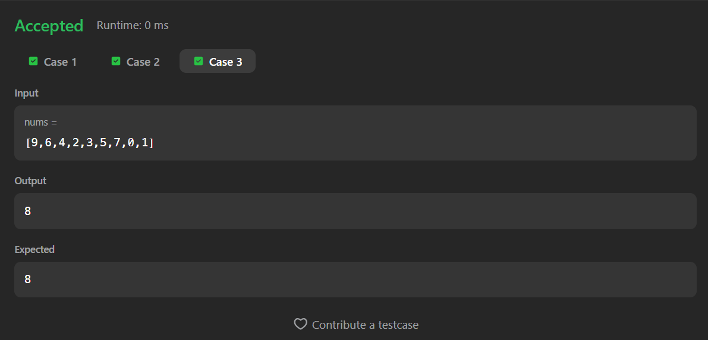

# 268. Missing Number

A Java solution to the LeetCode problem **Missing Number**, where an array contains `n` distinct numbers taken from the range `[0, n]`, and the task is to find the missing number.

This solution uses a **brute-force checking approach** by validating the presence of each number in the expected range.

---

## 📂 Files
- `Solution.java`

---

## 🧠 Concept Used
- Arrays
- Nested loops
- Range checking
- Boolean flag validation  
- Time Complexity: **O(n²)**  
- Space Complexity: **O(1)**

---

## Screenshot

### Test Case

### Accepted Submission

---

## 👨‍💻 Author

**Sujal Patil**

  
  

