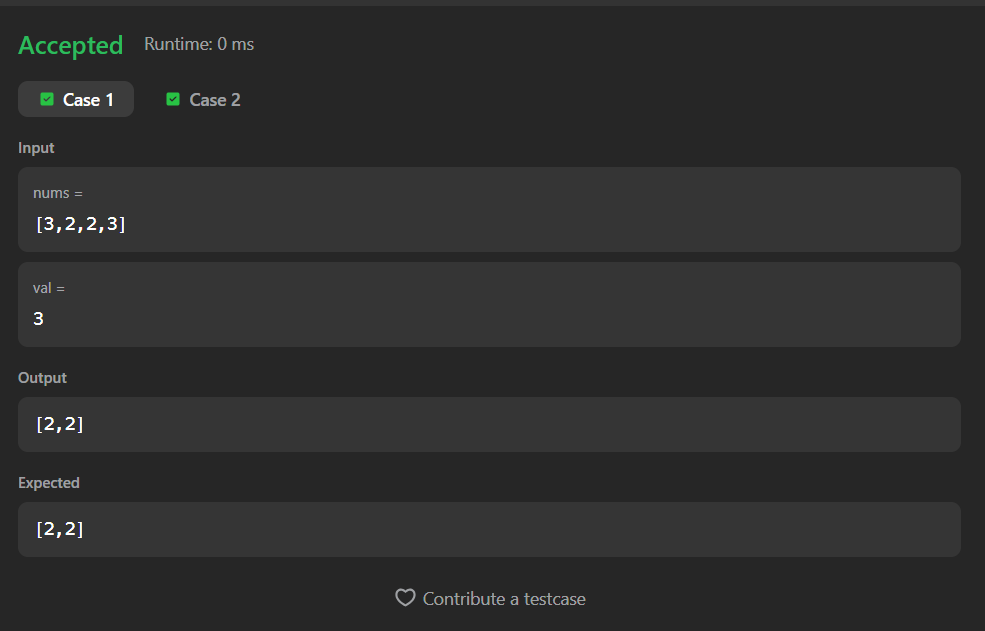

# 27. Remove Element

A Java solution to the LeetCode problem **Remove Element**, where all occurrences of a given value are removed **in-place** from the array, and the new length of the array is returned.

The solution uses a **two-pointer overwrite technique** to retain elements not equal to the given value.

---

## 📂 Files
- `Solution.java`

---

## 🧠 Concept Used
- Arrays
- Two-pointer technique
- In-place modification
- Conditional filtering  
- Time Complexity: **O(n)**  
- Space Complexity: **O(1)**

---

## Screenshot

### Test Case

### Accepted Submission

---

## 👨‍💻 Author

**Sujal Patil**

  
  

