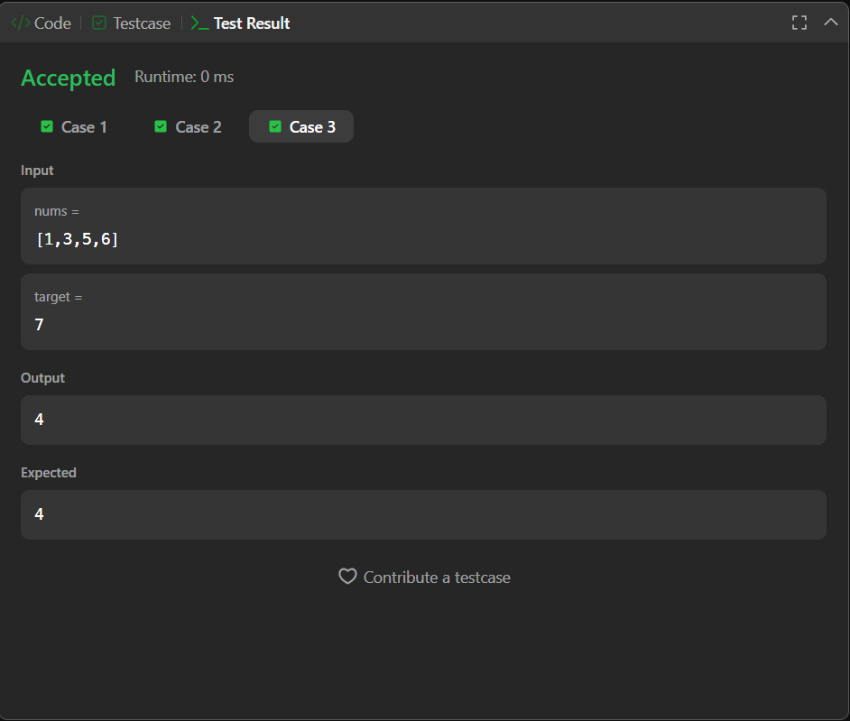

# Search Insert Position (LeetCode 35)

Binary Search–based solution to find the index of a target element in a sorted array, or the position where it should be inserted to maintain order. Achieves **O(log n)** time complexity.

---

## 📂 Files
- `Solution.java`

---

## 🧠 Concept Used
- Binary Search
- Loop Invariant (`start` as insertion point)
- Divide and Conquer
- Logarithmic Time Complexity

---

## 📸 Screenshot
  
  

---

## 👨‍💻 Author
**Sujal Patil**

  
  

