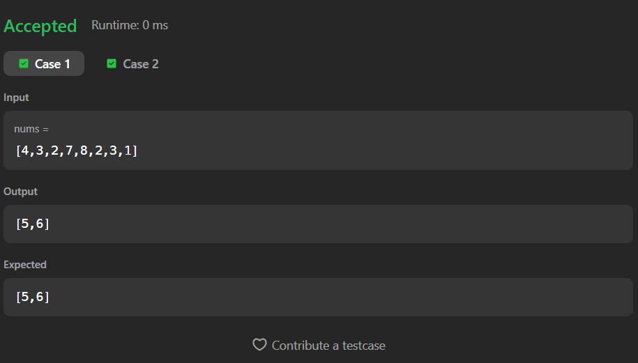

# 448. Find All Numbers Disappeared in an Array

A Java solution to the LeetCode problem **Find All Numbers Disappeared in an Array**, where the task is to find all numbers in the range `[1, n]` that do not appear in the array.

The solution uses a **HashSet** to track existing elements and then checks which numbers are missing from the expected range.

---

## ⏱️ Execution Time
21 minutes 50 seconds

---

## 📂 Files
- `Solution.java`

---

## 🧠 Concept Used
- Arrays
- HashSet
- Membership checking
- Linear traversal  
- Time Complexity: **O(n)**  
- Space Complexity: **O(n)**

---

## Screenshot

### Test Case

### Accepted Submission

---

## 👨‍💻 Author

**Sujal Patil**

  
  

