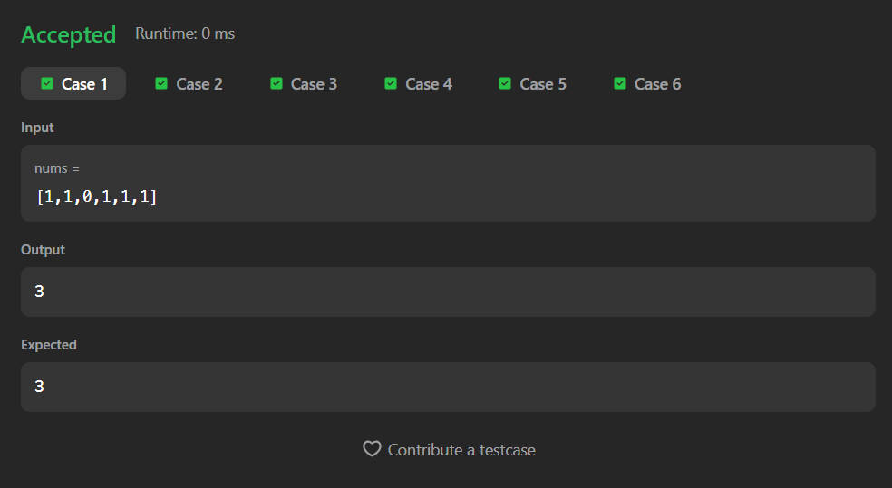
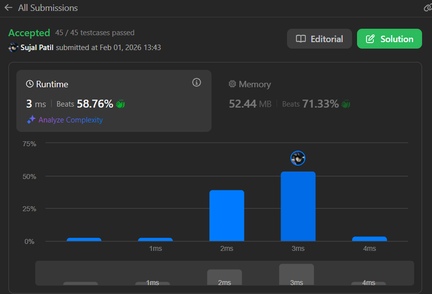

# 485. Max Consecutive Ones

A Java solution to the LeetCode problem **Max Consecutive Ones**, where the task is to find the maximum number of consecutive `1`s in a binary array.

The solution scans the array once, tracking the current streak of `1`s and maintaining the maximum streak found.

---

## 📂 Files
- `Solution.java`

---

## 🧠 Concept Used
- Arrays
- Linear traversal
- Counter reset logic
- Maximum value tracking  
- Time Complexity: **O(n)**  
- Space Complexity: **O(1)**

---

## Screenshot

### Test Case

### Accepted Submission

---

## 👨‍💻 Author

**Sujal Patil**

  
  

