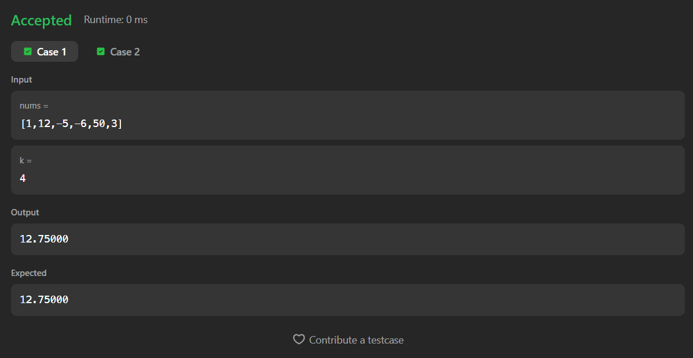
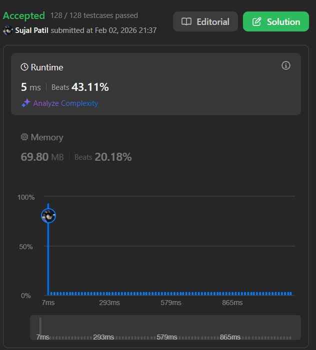

# 643. Maximum Average Subarray I

A Java solution to the LeetCode problem **Maximum Average Subarray I**, where the task is to find the maximum average value of any contiguous subarray of length `k`.

The solution uses a **sliding window technique** to compute subarray sums efficiently in linear time.

---

## ⏱️ Execution Time
52 minutes 51 seconds

---

## 📂 Files
- `Solution.java`

---

## 🧠 Concept Used
- Arrays
- Sliding window
- Running sum optimization
- Maximum value tracking  
- Time Complexity: **O(n)**  
- Space Complexity: **O(1)**

---

## Screenshot

### Test Case

### Accepted Submission

---

## 👨‍💻 Author

**Sujal Patil**

  
  

