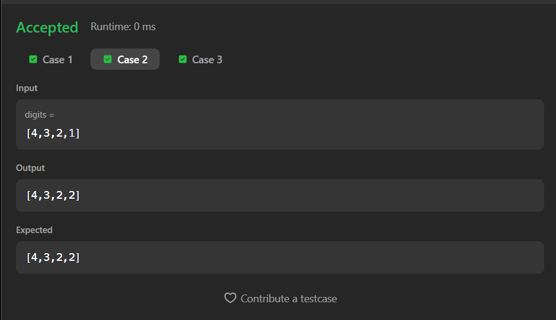
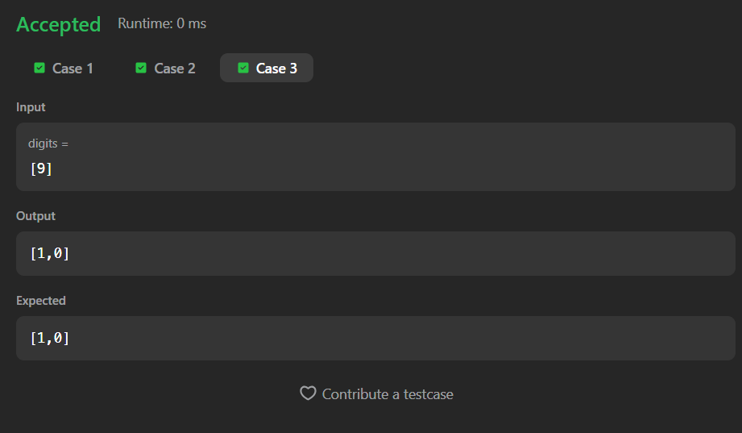

# 66. Plus One

A Java solution to the LeetCode problem **Plus One**, where an integer represented as an array of digits is incremented by one.

The solution handles carry propagation from right to left and accounts for the edge case where all digits are `9`, requiring an extra digit in the result.

---

## 📂 Files
- `Solution.java`

---

## 🧠 Concept Used
- Arrays
- Carry handling
- Reverse traversal
- Edge case handling (all 9s)  
- Time Complexity: **O(n)**  
- Space Complexity: **O(n)**

---

## Screenshot

### Test Case 1

### Test Case 2

### Test Case 3

---

## 👨‍💻 Author

**Sujal Patil**

  
  

