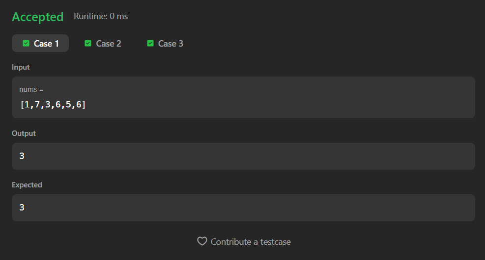
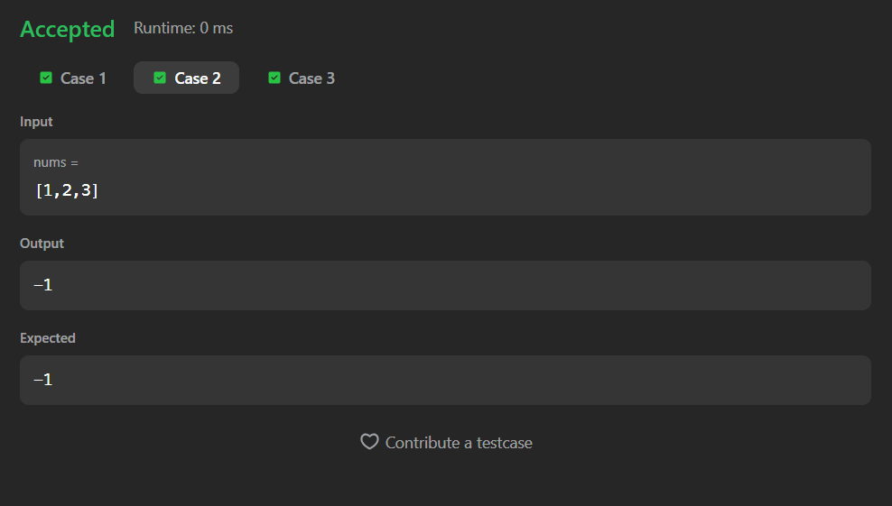
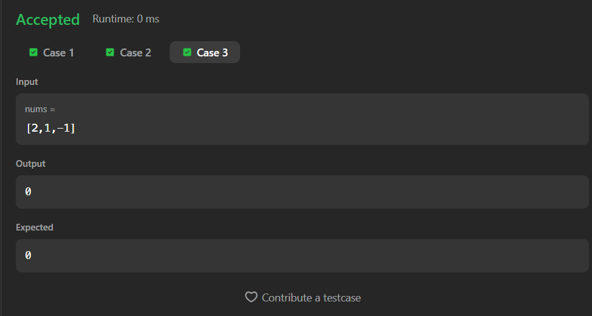

# 724. Find Pivot Index

A Java solution to the LeetCode problem **Find Pivot Index**, where the pivot index is the position such that the **sum of all elements to the left** is equal to the **sum of all elements to the right**.

The solution uses a **prefix-sum based approach** to compute the pivot index efficiently in linear time.

---

## 📂 Files
- `Solution.java`

---

## 🧠 Concept Used
- Arrays
- Prefix sum
- Left sum vs right sum comparison
- Two-pass traversal  
- Time Complexity: **O(n)**  
- Space Complexity: **O(1)**

---

## Screenshot

### Test Case 1

### Test Case 2

### Test Case 3

---

## 👨‍💻 Author

**Sujal Patil**

  
  

