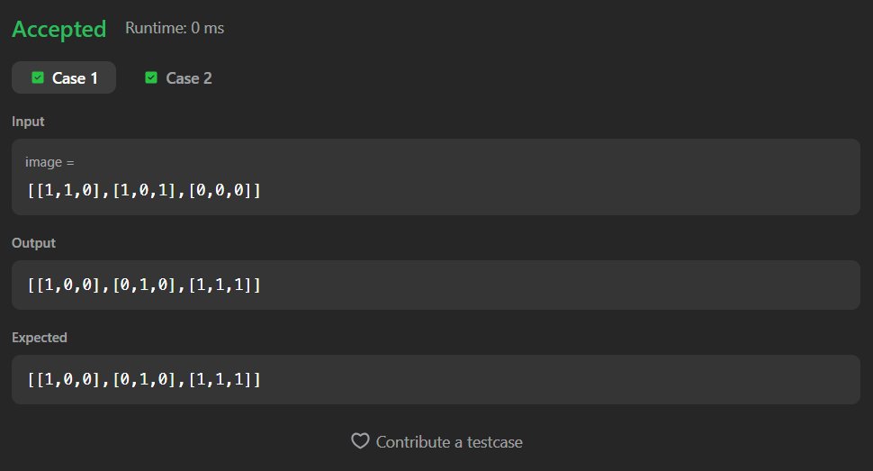
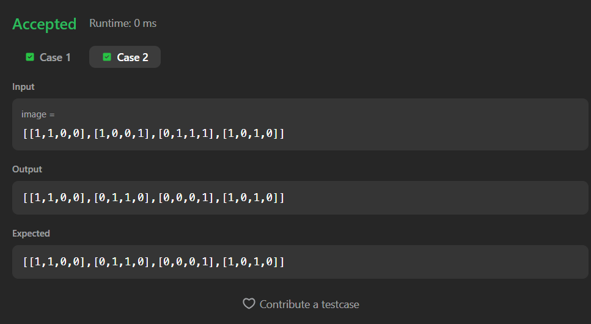

# 832. Flipping an Image

A Java solution to the LeetCode problem **Flipping an Image**, where each row of a binary matrix is first **horizontally flipped** and then **inverted** (`0 → 1`, `1 → 0`).

The solution efficiently performs both operations **in-place** using a two-pointer technique.

---

## 📂 Files
- `Solution.java`

---

## 🧠 Concept Used
- 2D Arrays
- Two-pointer technique
- In-place modification
- Bit inversion logic  
- Time Complexity: **O(m × n)**  
- Space Complexity: **O(1)**

---

## Screenshot

### Test Case 1

### Test Case 2

---

## 👨‍💻 Author

**Sujal Patil**

  
  

