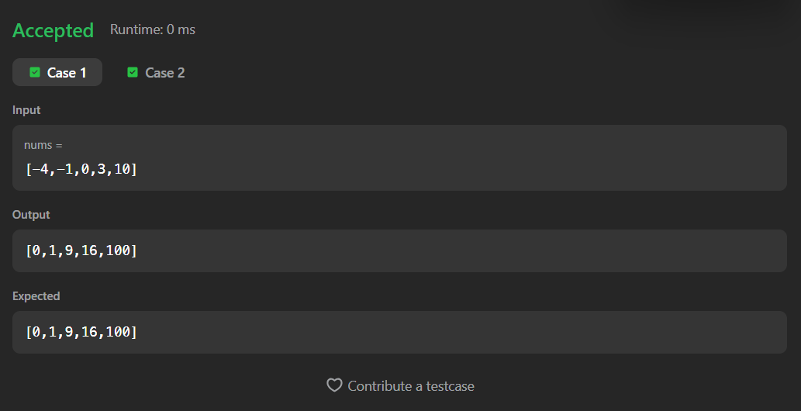

# 977. Squares of a Sorted Array

A Java solution to the LeetCode problem **Squares of a Sorted Array**, where each element of the input array is squared and the resulting array is sorted in non-decreasing order.

This solution first squares each element and then applies a **brute-force sorting approach** to reorder the elements.

---

## ⏱️ Execution Time
2 minutes 16 seconds

---

## 📂 Files
- `Solution.java`

---

## 🧠 Concept Used
- Arrays
- Element-wise transformation
- Nested loops
- Basic sorting logic  
- Time Complexity: **O(n²)**  
- Space Complexity: **O(1)**

---

## Screenshot

### Test Case

### Accepted Submission

---

## 👨‍💻 Author

**Sujal Patil**

  
  

