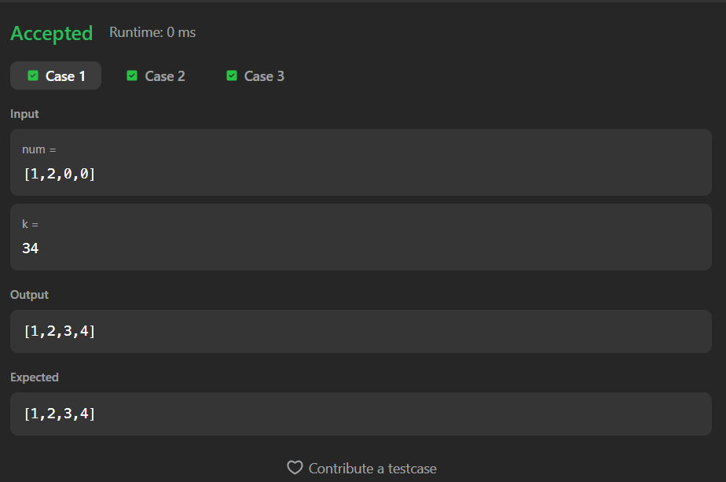
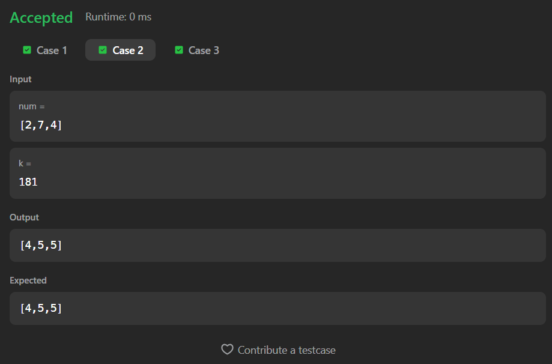
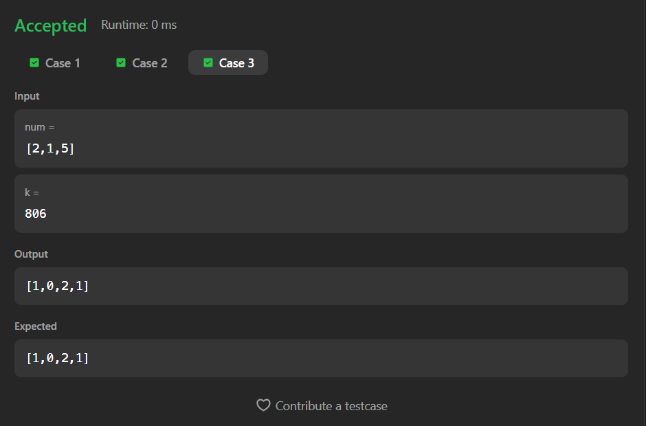

# 989. Add to Array-Form of Integer

A Java solution to the LeetCode problem **Add to Array-Form of Integer**, where an integer represented as an array is added to a given integer `k`, and the result is returned in array form.

The solution simulates **manual addition from right to left**, handling carry efficiently without converting the array to a number.

---

## 📂 Files
- `Solution.java`

---

## 🧠 Concept Used
- Arrays
- Carry-based addition
- Modulus and division operations
- Reverse traversal
- Dynamic list insertion  
- Time Complexity: **O(n)**  
- Space Complexity: **O(n)**

---

## Screenshot

### Test Case 1

### Test Case 2

### Test Case 3

---

## 👨‍💻 Author

**Sujal Patil**

  
  

