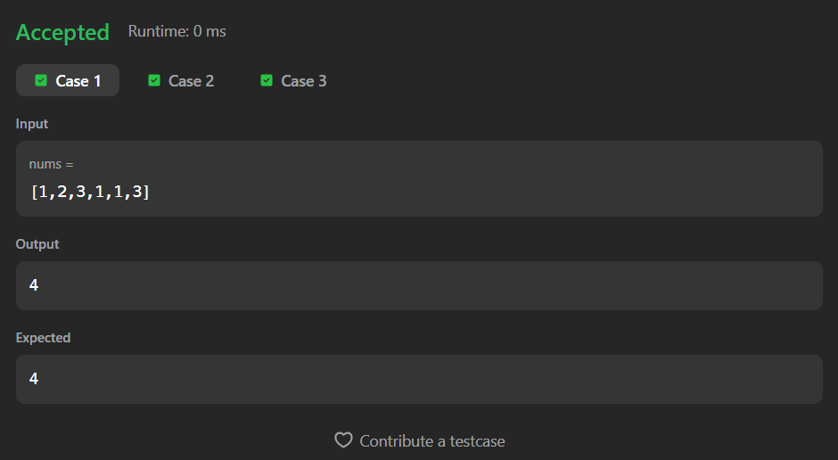
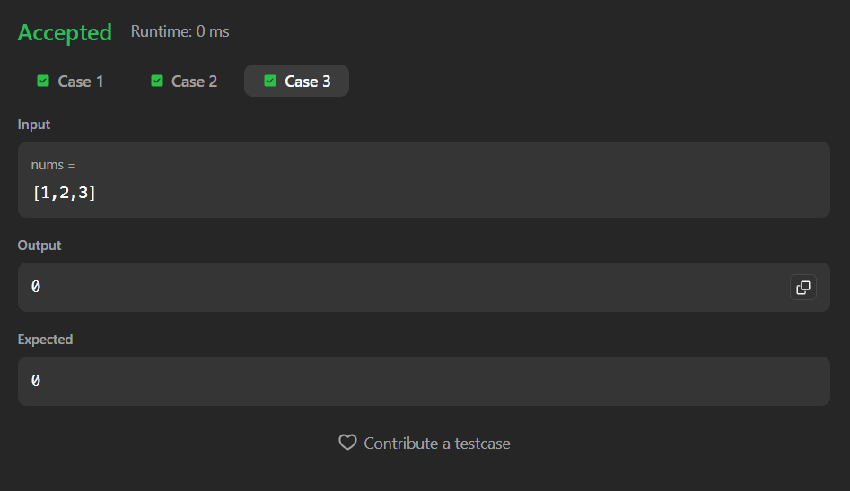

# 1512. Number of Good Pairs

A Java solution to the LeetCode problem **Number of Good Pairs**, where a pair `(i, j)` is considered good if  
`nums[i] == nums[j]` and `i < j`.

This solution uses a **HashMap-based frequency counting approach** to efficiently count valid pairs in a single traversal.

---

## 📂 Files
- `Solution.java`

---

## 🧠 Concept Used
- Arrays
- HashMap (frequency counting)
- One-pass traversal
- Incremental pair counting  
- Time Complexity: **O(n)**  
- Space Complexity: **O(n)**

---

## Screenshot

### Test Case 1

### Test Case 2

### Test Case 3

---

## 👨‍💻 Author

**Sujal Patil**

  
  

