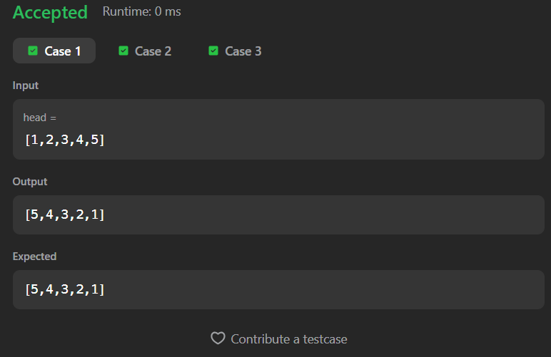
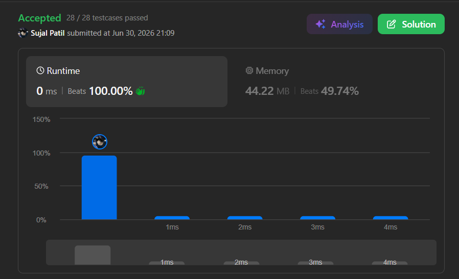

# 206. Reverse Linked List

A Java solution to the LeetCode problem **Reverse Linked List**, where the task is to reverse a singly linked list and return the new head.

The solution uses a **recursive approach** to reverse the links between nodes until the end of the list is reached, then rebuilds the reversed list during the recursive return.

---

## Files
- `Solution.java`

---

## Concept Used
- Linked List
- Recursion
- Pointer Manipulation
- In-place Reversal
- Recursive Traversal  
- Time Complexity: **O(n)**  
- Space Complexity: **O(n)** (recursion stack)

---

## Core Logic

- Initialize two pointers:
  - `temp` → points to the current node
  - `prev` → points to the previous node

- Recursively traverse the linked list until the end is reached.

- During each recursive call:
  - Store the next node
  - Reverse the current node's link
  - Pass the updated pointers to the next recursive call

- Once the end of the list is reached:
  - Return `prev`, which becomes the new head of the reversed list.

---

## Base Case

```text
if(temp == null){
    return prev;
}
```

- When all nodes have been processed, `prev` points to the new head of the reversed linked list.

---

## Recursive Step

```text
ListNode front = temp.next;
temp.next = prev;
return rev(head, front, temp);
```

- Store the next node before changing links.
- Reverse the current node's pointer.
- Recursively process the remaining linked list.

---

## Important Note

- The linked list is reversed **in-place**.
- No additional linked list is created.
- Each node is visited exactly once.
- The recursive call stack stores the traversal state.

---

## Screenshot

### Test Case


### Accepted Submission


---

## Author

**Sujal Patil**

[](https://github.com/SujalPatil21)  
[](https://www.linkedin.com/in/sujalpatil)  
[](mailto:sujalpatil21@gmail.com)