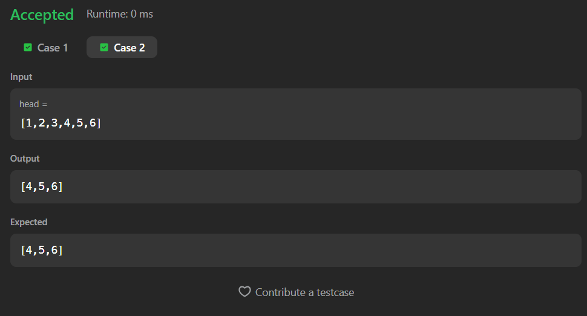
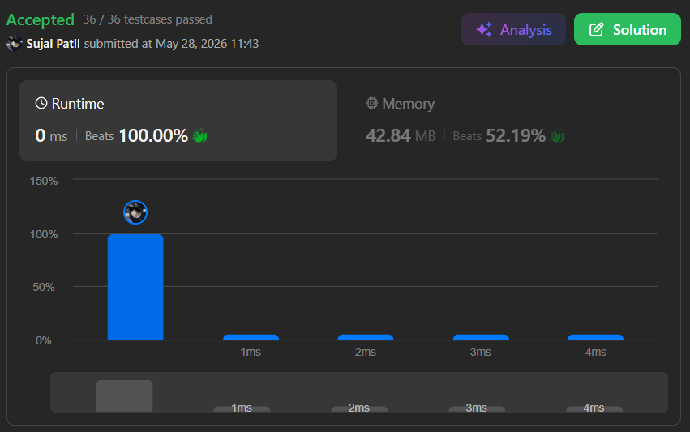

# 876. Middle of the Linked List

A Java solution to the LeetCode problem **Middle of the Linked List**, where the task is to return the middle node of a singly linked list.

If the linked list contains two middle nodes, the second middle node is returned.

The solution first calculates the size of the linked list and then traverses again to reach the middle position.

---

## Execution Time
Add your time here

---

## Files
- `Solution.java`

---

## Concept Used
- Linked List
- Traversal
- Counting nodes
- Two-pass approach  
- Time Complexity: **O(n)**  
- Space Complexity: **O(1)**

---

## Core Logic

- Step 1:
  - Calculate the total size of the linked list using traversal.

- Step 2:
  - Find the middle index using:

```text
middle = size / 2
```

- Step 3:
  - Traverse the linked list again until the middle position is reached.

- Step 4:
  - Return the node present at the middle index.

---

## Size Calculation

```text
while(node != null){

    node = node.next;
    size++;
}
```

- Counts the total number of nodes in the linked list.

---

## Middle Traversal

```text
for(int i = 0; i < middle; i++){
    temp = temp.next;
}
```

- Moves the pointer to the middle node.

---

## Important Note

- If the linked list has:
  - Odd number of nodes → exact middle node is returned
  - Even number of nodes → second middle node is returned

---

## Screenshot

### Test Case


### Accepted Submission


---

## Author

**Sujal Patil**

[](https://github.com/SujalPatil21)  
[](https://www.linkedin.com/in/sujalpatil)  
[](mailto:sujalpatil21@gmail.com)