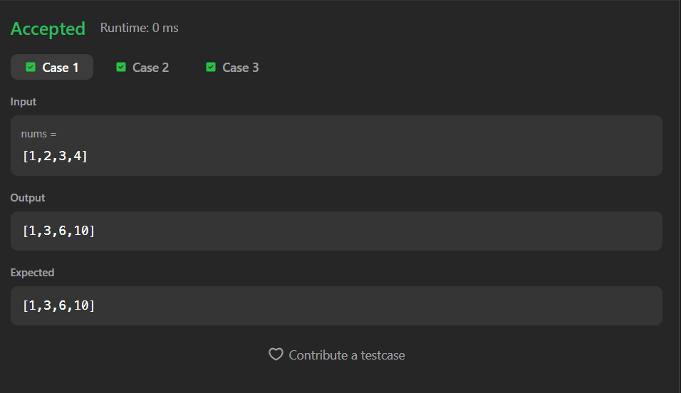
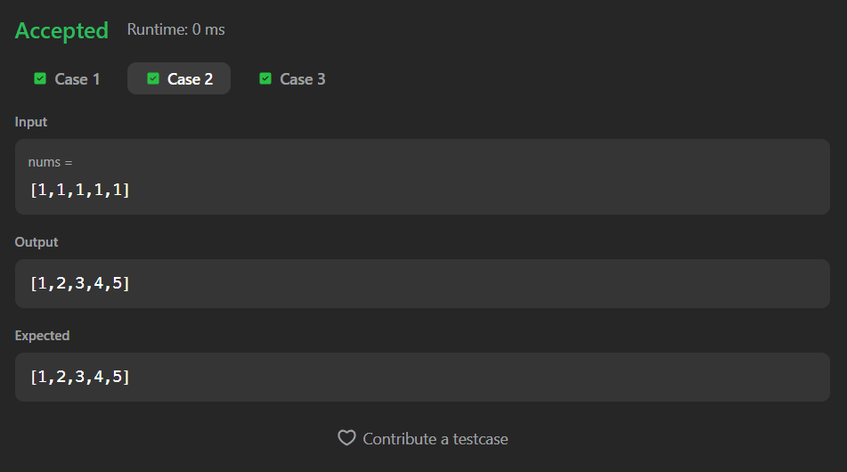

# 1480. Running Sum of 1D Array

A Java solution to the LeetCode problem **Running Sum of 1D Array**, where each element at index `i` is replaced by the sum of all elements from index `0` to `i`.  
The solution uses an in-place single-pass approach for optimal performance.

---

## 📂 Files
- `Solution.java`

---

## 🧠 Concept Used
- Arrays
- Prefix Sum (Running Sum)
- In-place array modification
- Linear traversal  
- Time Complexity: **O(n)**  
- Space Complexity: **O(1)**

---

## Screenshot

### Test Case 1

### Test Case 2

### Test Case 3

---

## 👨‍💻 Author

**Sujal Patil**

  
  

        for(int i = 1 ; i < nums.length ; i++){

            nums[i] =  nums[i-1] + nums[i];
        }

        return nums;

    }
}