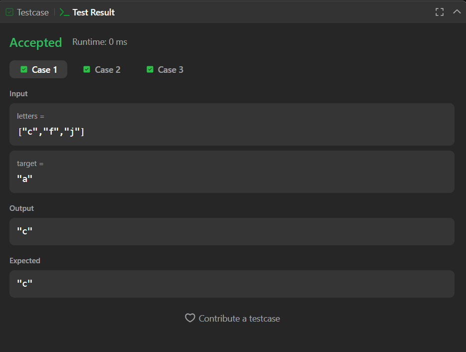
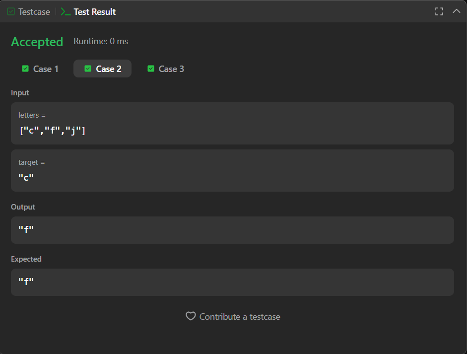

# Next Greatest Letter (LeetCode 744)

Solution for **LeetCode #744 – Find Smallest Letter Greater Than Target** using Binary Search.  
The goal is to find the smallest character strictly greater than the target, with wrap-around handling.

---

## 📂 Files
- `Solution.java`

---

## 🧠 Concept Used
- Binary Search
- Ceiling concept in sorted array
- Wrap-around handling using modulo
- Time Complexity: **O(log n)**
- Space Complexity: **O(1)**

---

## 📸 Screenshot
  
  

---

## 👨‍💻 Author

**Sujal Patil**

  
  

