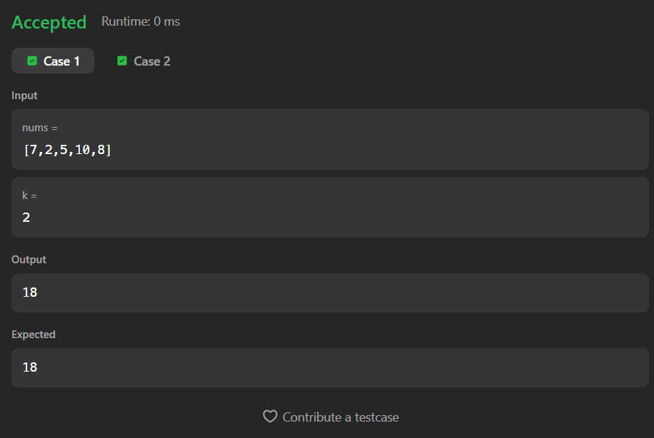

# 410. Split Array Largest Sum

## Description
Given an integer array `nums` and an integer `k`, split the array into `k` or fewer subarrays such that the largest sum among these subarrays is minimized.

---

## Files
- `Solution.java` → Binary Search on Answer implementation

---

## Concepts Used
- Binary Search on Answer  
- Greedy Partitioning  
- Array Traversal  

**Time Complexity:** O(n * log(sum))  
**Space Complexity:** O(1)

---

## Approach
- The answer lies between:
  - **low = max element in array**
  - **high = sum of array**

- Apply binary search on this range:
  - For a given `mid`, check how many subarrays are needed
  - If more than `k` → increase `low`
  - Else → try minimizing by reducing `high`

- Helper function:
  - Counts how many subarrays are required such that no subarray sum exceeds `mid`

---

## Screenshot

## Accepted Submission

---

## Author
Sujal Patil 

---

## Execution Time
2 Hours + 
