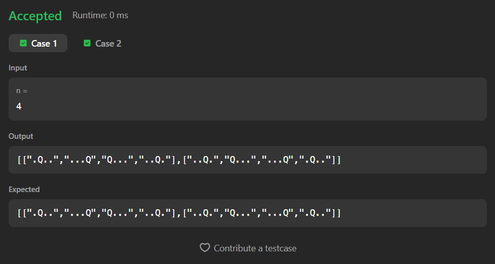

# 17. Letter Combinations of a Phone Number

A Java solution to the LeetCode problem **Letter Combinations of a Phone Number**, where the task is to return all possible letter combinations that a given digit string could represent based on the telephone keypad mapping.

The solution uses a recursive backtracking approach to generate every possible character combination.

---

## Execution Time
54 Minutes

---

## Files
- `Solution.java`

---

## Concept Used
- Recursion
- Backtracking
- HashMap
- String building
- Decision tree traversal  
- Time Complexity: **O(4ⁿ × n)**  
- Space Complexity: **O(n)** (recursion stack)

---

## Core Logic

- Each digit maps to a set of characters based on the phone keypad.
- The recursion processes one digit at a time.
- For every character mapped to the current digit:
  - Append the character to the current string
  - Recursively process the next digit

- Base Case:
  - When `index == digits.length()`
  - A complete combination is formed
  - Add the current string to the answer list

- Recursive Step:

```java
for (char ch : letters) {
    solve(digits, index + 1, current + ch, ans);
}
```

- The recursion explores all possible paths of character combinations.

---

## Screenshot

### Test Case


### Accepted Submission


---

## Author

**Sujal Patil**

[](https://github.com/SujalPatil21)  
[](https://www.linkedin.com/in/sujalpatil)  
[](mailto:sujalpatil21@gmail.com)