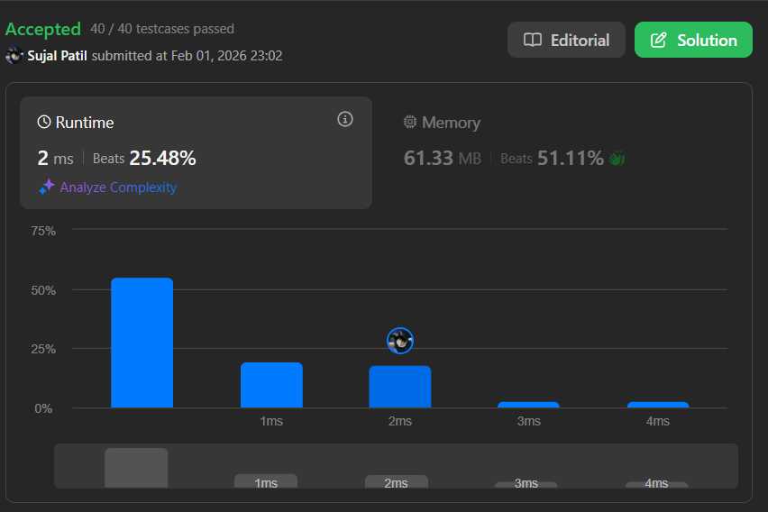
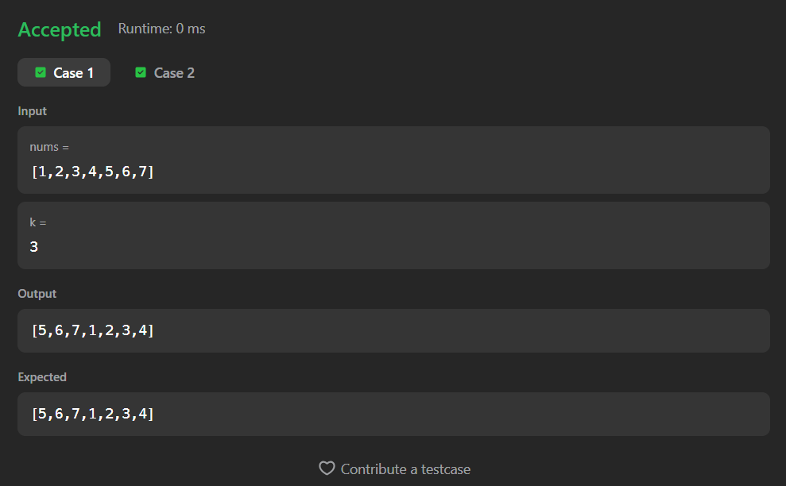

# 189. Rotate Array

A Java solution to the LeetCode problem **Rotate Array**, where the array is rotated to the right by `k` steps.

The solution uses the **array reversal technique**, rotating the array in-place by reversing:
1. The entire array  
2. The first `k` elements  
3. The remaining elements  

This achieves optimal performance without extra space.

---

## 📂 Files
- `Solution.java`

---

## 🧠 Concept Used
- Arrays
- In-place array reversal
- Modulo operation
- Two-pointer swapping  
- Time Complexity: **O(n)**  
- Space Complexity: **O(1)**

---

## Screenshot

### Test Case

### Accepted Submission

---

## 👨‍💻 Author

**Sujal Patil**

  
  

