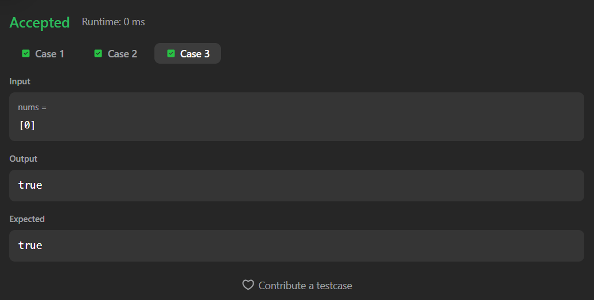
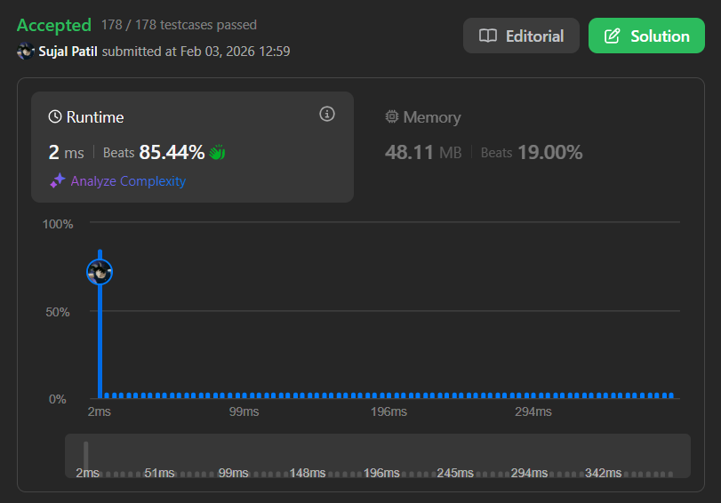

# 55. Jump Game

A Java solution to the LeetCode problem **Jump Game**, where the task is to determine whether you can reach the last index of the array starting from the first index, given that each element represents the maximum jump length from that position.

The solution uses a **greedy approach** to track the farthest reachable index while traversing the array.

---

## ⏱️ Execution Time
41 minutes 6 seconds

---

## 📂 Files
- `Solution.java`

---

## 🧠 Concept Used
- Arrays
- Greedy algorithm
- Reachability tracking
- Single-pass traversal  
- Time Complexity: **O(n)**  
- Space Complexity: **O(1)**

---

## Screenshot

### Test Case

### Accepted Submission

---

## 👨‍💻 Author

**Sujal Patil**

  
  

