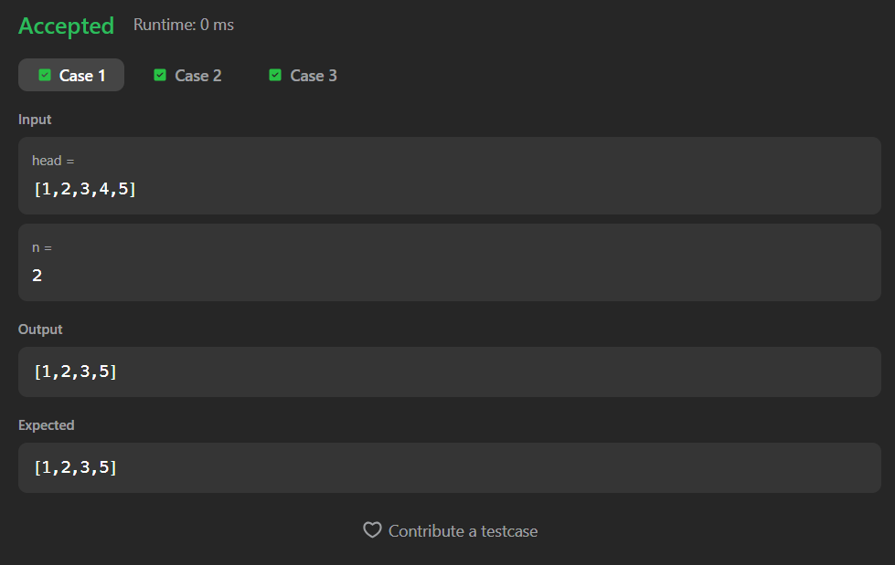
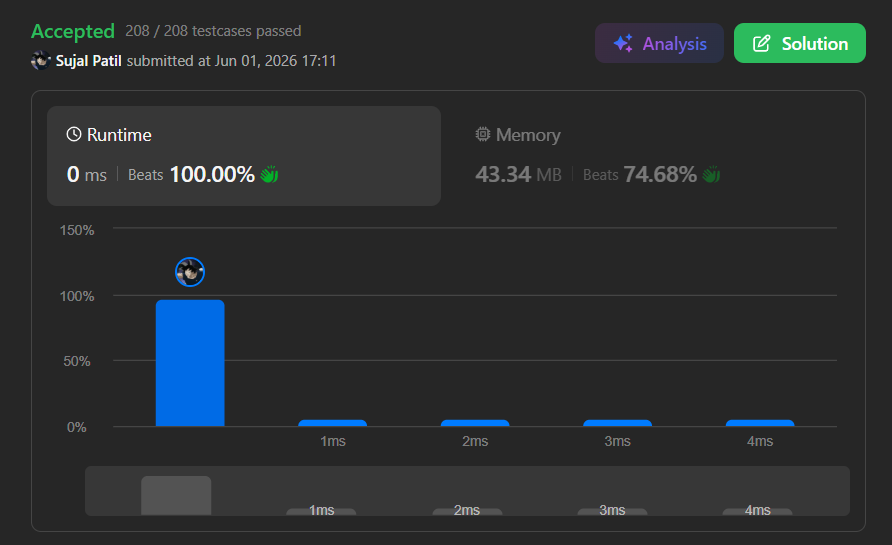

# 19. Remove Nth Node From End of List

A Java solution to the LeetCode problem **Remove Nth Node From End of List**, where the task is to remove the `n`th node from the end of a singly linked list and return the modified list.

The solution first calculates the size of the linked list, determines the position of the node to remove from the beginning, and then updates the links to delete the target node.

---

## Files
- `Solution.java`

---

## Concept Used
- Linked List
- Traversal
- Node Deletion
- Length Calculation
- Two-pass Approach  
- Time Complexity: **O(n)**  
- Space Complexity: **O(1)**

---

## Core Logic

- Step 1:
  - Calculate the total number of nodes in the linked list.

- Step 2:
  - Find the position of the node to delete from the beginning:

```text
position = size - n
```

- Step 3:
  - Handle the special case where the head node must be removed.

- Step 4:
  - Traverse to the node just before the target node.

- Step 5:
  - Remove the target node by updating the links.

---

## Length Calculation

```text
while(temp != null){
    temp = temp.next;
    size++;
}
```

- Counts the total number of nodes in the linked list.

---

## Head Removal Case

```text
if(size == n){
    return head.next;
}
```

- If the node to remove is the head node, return the next node as the new head.

---

## Node Deletion

```text
temp.next = temp.next.next;
```

- Removes the target node from the linked list.
- Connects the previous node directly to the next node.

---

## Important Note

- If `n` equals the size of the linked list:
  - The head node is removed.
- Otherwise:
  - The `n`th node from the end is deleted.
- No extra linked list is created.

---

## Screenshot

### Test Case


### Accepted Submission


---

## Author

**Sujal Patil**

[](https://github.com/SujalPatil21)  
[](https://www.linkedin.com/in/sujalpatil)  
[](mailto:sujalpatil21@gmail.com)