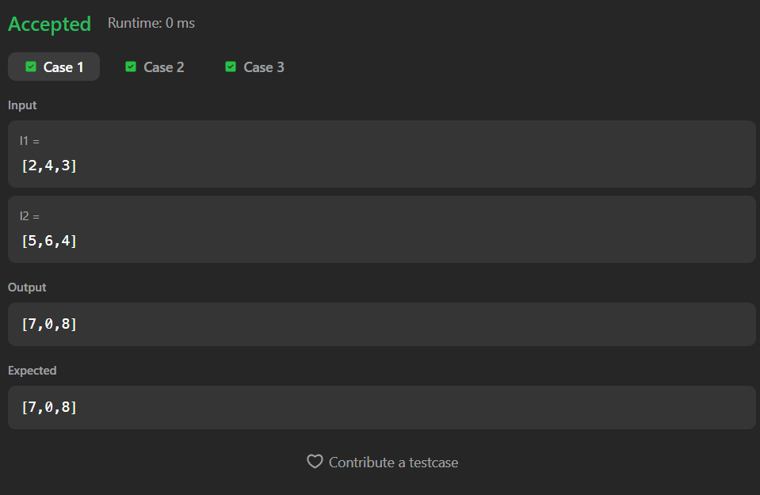

# 2. Add Two Numbers

A Java solution to the LeetCode problem **Add Two Numbers**, where two non-empty linked lists represent two non-negative integers in reverse order.

Each node contains a single digit, and the task is to return the sum as a linked list in the same reverse-order format.

The solution traverses both linked lists simultaneously while maintaining a carry value for digit overflow.

---


## Files
- `Solution.java`

---

## Concept Used
- Linked List
- Traversal
- Dummy Node
- Carry Handling
- Node Creation
- Simulation of Addition  
- Time Complexity: **O(max(n, m))**  
- Space Complexity: **O(max(n, m))**

---

## Core Logic

- Create a dummy node to simplify result list construction.

- Traverse both linked lists simultaneously.

- For each position:
  - Add values from both nodes
  - Add any carry from the previous step
  - Create a new node using:

```text
sum % 10
```

- Update carry using:

```text
carry = sum / 10
```

- Move pointers forward until both linked lists are fully traversed.

- If a carry remains after traversal:
  - Create one final node containing the carry.

---

## Dummy Node Usage

```text
ListNode dummyNode = new ListNode(-1);
```

- Helps build the answer list without handling special cases for the head node.

---

## Node Creation

```text
ListNode node = new ListNode(sum % 10);
```

- Stores the current digit of the result.

---

## Carry Handling

```text
carry = sum / 10;
```

- Maintains overflow for the next digit addition.

---

## Final Carry Check

```text
if(carry != 0){
    current.next = new ListNode(carry);
}
```

- Ensures any remaining carry is included in the final answer.

---

## Screenshot

### Test Case


### Accepted Submission


---

## Author

**Sujal Patil**

[](https://github.com/SujalPatil21)  
[](https://www.linkedin.com/in/sujalpatil)  
[](mailto:sujalpatil21@gmail.com)