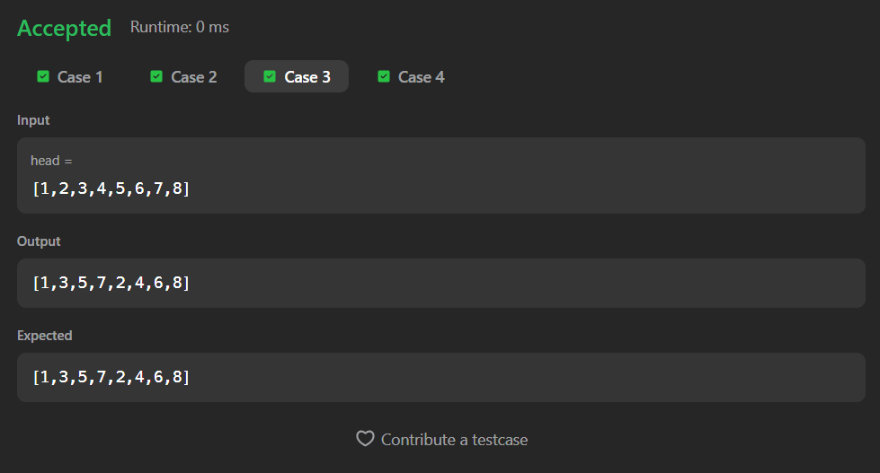
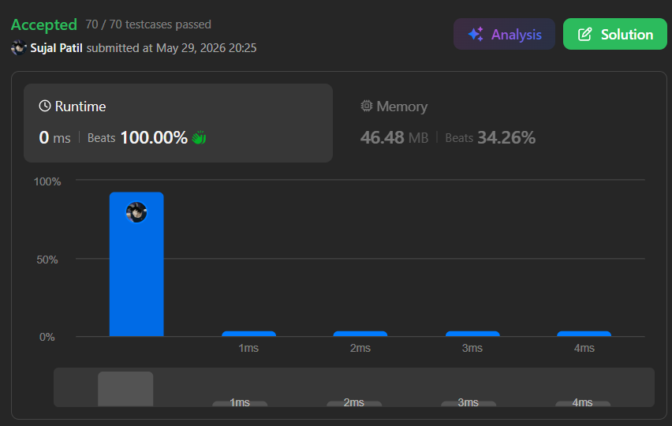

# 328. Odd Even Linked List

A Java solution to the LeetCode problem **Odd Even Linked List**, where the task is to group all nodes positioned at odd indices together followed by all nodes positioned at even indices.

The relative order of odd and even nodes is preserved, and the solution rearranges the existing nodes without creating additional linked lists.

---


## Files
- `Solution.java`

---

## Concept Used
- Linked List
- Pointer Manipulation
- In-place Rearrangement
- Odd-Even Partitioning
- Single Traversal  
- Time Complexity: **O(n)**  
- Space Complexity: **O(1)**

---

## Core Logic

- Handle edge cases:
  - Empty linked list
  - Single-node linked list

- Maintain three pointers:
  - `odd` → tracks the odd-positioned nodes
  - `even` → tracks the even-positioned nodes
  - `even_head` → stores the head of the even list

- Traverse the linked list:
  - Connect odd nodes together
  - Connect even nodes together
  - Move both pointers forward

- After traversal:
  - Attach the even list to the end of the odd list

---

## Initialization

```text
ListNode odd = head;
ListNode even = head.next;
ListNode even_head = head.next;
```

- `even_head` is preserved so the even list can be attached later.

---

## Rearranging Nodes

```text
odd.next = odd.next.next;
even.next = even.next.next;
```

- Separates odd and even positioned nodes into two chains.

---

## Final Connection

```text
odd.next = even_head;
```

- Attaches all even-positioned nodes after the odd-positioned nodes.

---

## Important Note

- Node values are not modified.
- Only links between nodes are changed.
- The relative order of odd nodes remains unchanged.
- The relative order of even nodes remains unchanged.

---

## Screenshot

### Test Case


### Accepted Submission


---

## Author

**Sujal Patil**

[](https://github.com/SujalPatil21)  
[](https://www.linkedin.com/in/sujalpatil)  
[](mailto:sujalpatil21@gmail.com)