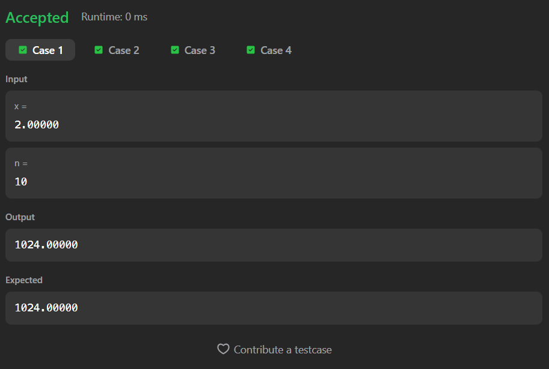

# 50. Pow(x, n)

## Description
Implement `pow(x, n)`, which calculates x raised to the power n (i.e., xⁿ).

The solution must handle:
- Negative powers  
- Large values of n  
- Efficient computation  

---

## Files
- `Main.java` → Binary Exponentiation implementation

---

## Concepts Used
- Binary Exponentiation  
- Bit Manipulation (n / 2, n % 2)  
- Handling Negative Powers  

**Time Complexity:** O(log n)  
**Space Complexity:** O(1)

---

## Approach
- Convert `n` to long to avoid overflow (important for edge case: n = Integer.MIN_VALUE)
- Use Binary Exponentiation:
  - If power is odd → multiply result by x  
  - Square x at every step  
  - Divide power by 2  

- If n is negative:
  - Return reciprocal → `1 / result`

---

## Key Observations
- Brute force O(n) is too slow  
- Binary exponentiation reduces it to O(log n)  
- Works because:
  - xⁿ = (x²)^(n/2)  
  - If n is odd → multiply one extra x  

---

## Screenshot

## Accepted Submission

---

## Author

**Sujal Patil**

  
  

---

## Execution Time
2 HOURS + 