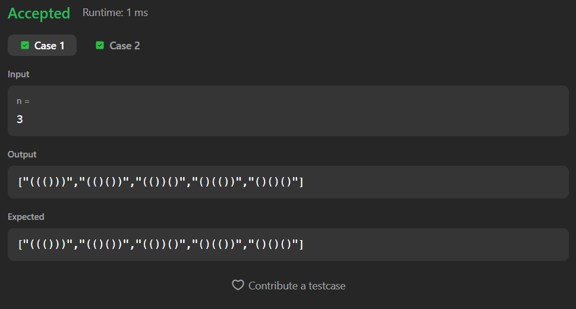

# 22. Generate Parentheses

A Java solution to the LeetCode problem **Generate Parentheses**, where the task is to generate all combinations of well-formed parentheses for a given number `n`.

The solution uses recursion and backtracking to build valid parenthesis combinations step by step.

---

## Execution Time
Add your time here

---

## Files
- `Solution.java`

---

## Concept Used
- Recursion
- Backtracking
- String construction
- Decision tree traversal
- Constraint checking  
- Time Complexity: **O(4ⁿ / √n)**  
- Space Complexity: **O(n)** (recursion stack)

---

## Core Logic

- The recursion builds the string one character at a time.

- Two counters are maintained:
  - `open`  → number of opening brackets used
  - `close` → number of closing brackets used

- Rules followed:
  - Add `"("` only if `open < total`
  - Add `")"` only if `close < open`

- Base Case:
  - When:

```text
current.length() == 2 * total
```

  - A valid parenthesis combination is formed
  - Add the string to the answer list

---

## Recursive Calls

```text
solve(current + "(", open + 1, close, total, ans);

solve(current + ")", open, close + 1, total, ans);
```

- Backtracking explores all valid combinations recursively.

---

## Important Constraint

```text
if(close < open)
```

- This condition ensures:
  - Invalid parenthesis combinations are never generated

---

## Screenshot

### Test Case


### Accepted Submission


---

## Author

**Sujal Patil**

[](https://github.com/SujalPatil21)  
[](https://www.linkedin.com/in/sujalpatil)  
[](mailto:sujalpatil21@gmail.com)