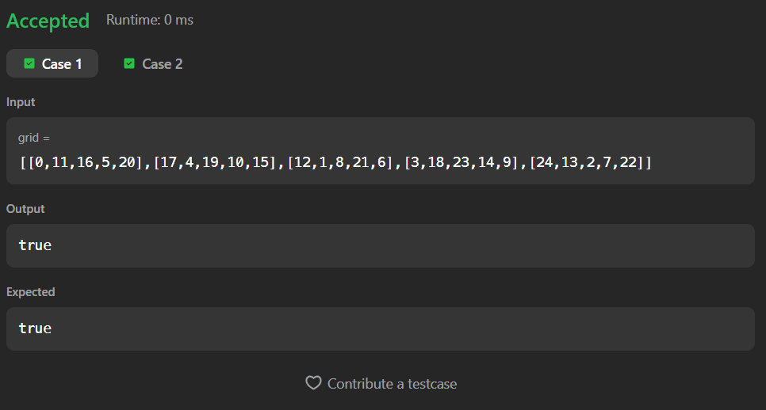
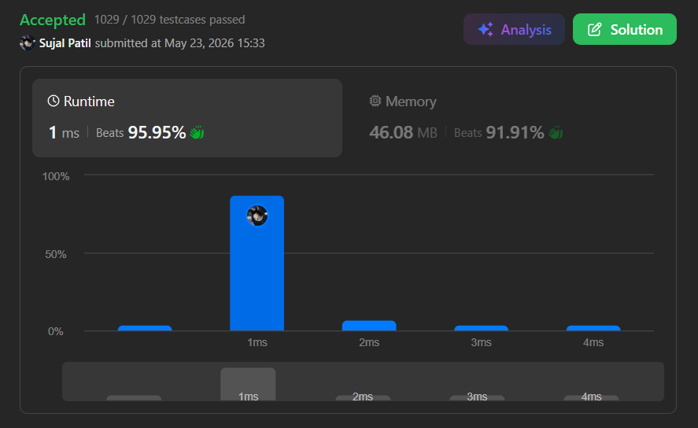

# 2596. Check Knight Tour Configuration

A Java solution to the LeetCode problem **Check Knight Tour Configuration**, where the task is to determine whether a given grid represents a valid Knight’s Tour on a chessboard.

The solution uses recursion and backtracking to verify whether each move follows the valid knight movement pattern in the correct sequence.

---

## Execution Time
Add your time here

---

## Files
- `Solution.java`

---

## Concept Used
- Recursion
- Backtracking
- Matrix traversal
- Knight movement validation
- Recursive path checking  
- Time Complexity: **O(n²)**  
- Space Complexity: **O(n²)** (recursive call stack in worst case)

---

## Core Logic

- The recursion starts from `(0,0)` with the expected value `0`.

- At every recursive call:
  - Check whether:
    - The position is inside the grid
    - The current cell value matches the expected move number

- If the position is invalid:
  - Return `false`

- Base Case:
  - When:

``` id="w7d5tb"
expectedvalue == n * n - 1
```

  - The complete Knight’s Tour is successfully verified
  - Return `true`

- The algorithm recursively checks all 8 possible knight moves:

``` id="tmzjku"
boolean ans1 = isValid(grid,row-2,col + 1 , n , expectedvalue+1);
boolean ans2 = isValid(grid,row-1,col + 2 , n , expectedvalue+1);
boolean ans3 = isValid(grid,row+1,col + 2 , n , expectedvalue+1);
boolean ans4 = isValid(grid,row+2,col + 1 , n , expectedvalue+1);
boolean ans5 = isValid(grid,row+2,col - 1 , n , expectedvalue+1);
boolean ans6 = isValid(grid,row+1,col - 2 , n , expectedvalue+1);
boolean ans7 = isValid(grid,row-1,col - 2 , n , expectedvalue+1);
boolean ans8 = isValid(grid,row-2,col - 1 , n , expectedvalue+1);
```

- Final Result:

``` id="7yqozf"
return ans1 || ans2 || ans3 || ans4 ||
       ans5 || ans6 || ans7 || ans8;
```

- If any recursive path returns `true`, the configuration is valid.

---

## Screenshot

### Test Case


### Accepted Submission


---

## Author

**Sujal Patil**

[](https://github.com/SujalPatil21)  
[](https://www.linkedin.com/in/sujalpatil)  
[](mailto:sujalpatil21@gmail.com)