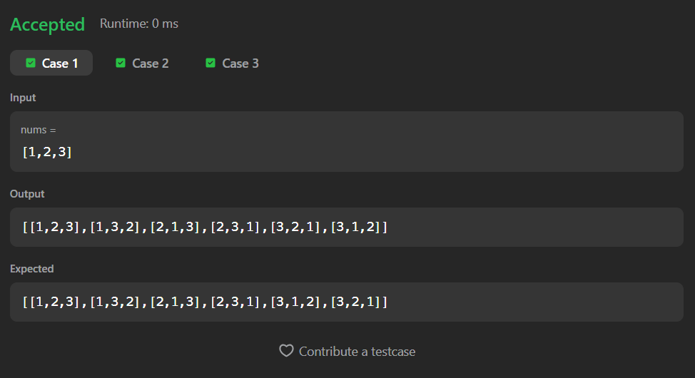

# 46. Permutations

A Java solution to the LeetCode problem **Permutations**, where the task is to generate all possible permutations of a given integer array.

The solution uses a recursive backtracking approach with in-place swapping to efficiently generate permutations.

---

## Execution Time
Add your time here

---

## Files
- `Solution.java`

---

## Concept Used
- Recursion
- Backtracking
- In-place swapping
- Permutation generation
- Recursive tree traversal  
- Time Complexity: **O(n × n!)**  
- Space Complexity: **O(n)** (recursion stack)

---

## Core Logic

- The algorithm fixes one element at a time for each position.
- For every recursive call:
  - Swap the current index with every possible index
  - Recursively generate permutations for the remaining array
  - Backtrack by swapping again to restore the original array

- Base Case:
  - When `index == nums.length`
  - A complete permutation is formed
  - Copy the array into a temporary list and add it to the answer

- Backtracking Step:

```java
swap(nums, i, index);
per(nums, index + 1, ans);
swap(nums, i, index);

-The second swap restores the array state for future recursive calls.

```

---

## Screenshot

### Test Case


### Accepted Submission


---

## Author

**Sujal Patil**

[](https://github.com/SujalPatil21)  
[](https://www.linkedin.com/in/sujalpatil)  
[](mailto:sujalpatil21@gmail.com)