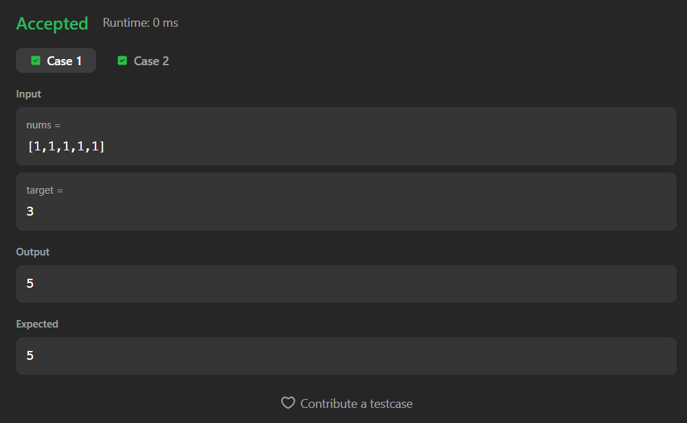

# 494. Target Sum

A Java solution to the LeetCode problem **Target Sum**, where the task is to assign `+` and `-` signs to each element in the array such that the resulting expression equals the given target.

The solution uses a recursive backtracking approach to explore all possible combinations of adding and subtracting each number.

---

## Execution Time
2 Hours
---

## Files
- `Solution.java`

---

## Concept Used
- Recursion
- Backtracking
- Decision tree exploration
- Base case validation  
- Time Complexity: **O(2ⁿ)**  
- Space Complexity: **O(n)** (recursion stack)

---

## Core Logic

- At each index, there are two choices:
  - Add the current number to the target
  - Subtract the current number from the target  

- This creates a binary recursion tree of possibilities.

- Base Case:
  - When the index reaches the end of the array:
    - If `target == 0`, it means a valid combination is found → return `1`
    - Otherwise → return `0`

- Final Answer:
  - Sum of all valid combinations from recursive calls:
    ```
    return add + subtract;
    ```

---

## Screenshot

### Test Case


### Accepted Submission


---

## Author

**Sujal Patil**

[](https://github.com/SujalPatil21)  
[](https://www.linkedin.com/in/sujalpatil)  
[](mailto:sujalpatil21@gmail.com)