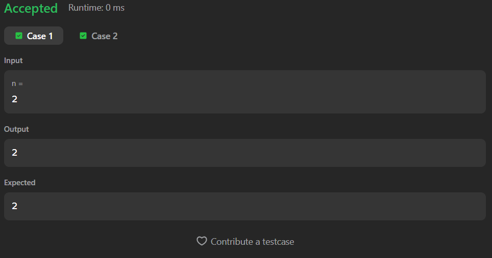

# 526. Beautiful Arrangement

A Java solution to the LeetCode problem **Beautiful Arrangement**, where the task is to count the number of valid permutations of numbers from `1` to `n` such that:

- `pos % number == 0`
- or `number % pos == 0`

for every position in the arrangement.

The solution uses recursion and backtracking to generate and validate all possible arrangements.

---

## Execution Time
1 Hour

---

## Files
- `Solution.java`

---

## Concept Used
- Recursion
- Backtracking
- Permutation generation
- Boolean visited array
- Constraint checking  
- Time Complexity: **O(n!)**  
- Space Complexity: **O(n)**

---

## Core Logic

- The recursion places numbers position by position.

- A `visited[]` array is used to:
  - Track numbers already used in the arrangement

- For every position:
  - Try all numbers from `1` to `n`
  - Only place a number if:
  
```text
pos % i == 0 || i % pos == 0
```

- If the condition is satisfied:
  - Mark the number as visited
  - Move to the next position recursively
  - Backtrack after recursion

---

## Base Case

```text
if(pos > n)
```

- A valid arrangement is formed
- Increase the count

---

## Recursive Step

```text
visited[i] = true;

calculate(n, pos + 1, visited);

visited[i] = false;
```

- The last step restores the state for future recursive calls.

---

## Important Constraint

```text
(pos % i == 0 || i % pos == 0)
```

- Ensures only valid numbers are placed at each position.

---

## Screenshot

### Test Case


### Accepted Submission


---

## Author

**Sujal Patil**

[](https://github.com/SujalPatil21)  
[](https://www.linkedin.com/in/sujalpatil)  
[](mailto:sujalpatil21@gmail.com)