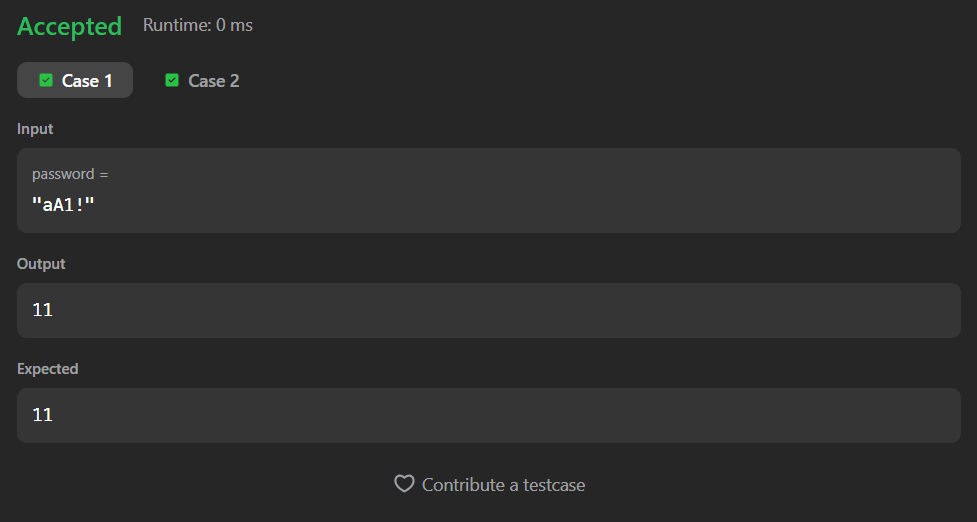
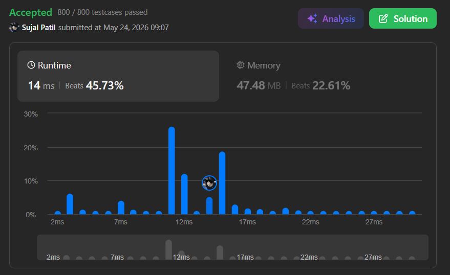

# Password Strength Checker

A Java solution that calculates the strength of a password based on different character categories and uniqueness of characters.

The solution uses a combination of `HashMap` and `HashSet` to assign scores and avoid counting duplicate characters multiple times.

---

## Execution Time
Add your time here

---

## Files
- `Solution.java`

---

## Concept Used
- HashMap
- HashSet
- Character mapping
- String traversal
- Duplicate handling  
- Time Complexity: **O(n)**  
- Space Complexity: **O(1)**

---

## Core Logic

- Different character categories are assigned different scores:

  - Lowercase letters → `1`
  - Uppercase letters → `2`
  - Digits → `3`
  - Special characters → `5`

- A `HashMap` stores the score for each character.

- A `HashSet` is used to ensure:
  - Duplicate characters are counted only once

- The password is traversed character by character:
  - If the character is not already present in the set:
    - Add its score to the total
    - Store the character in the set

- Final strength score is returned.

---

## Character Score Mapping

```text
Lowercase Letters  -> 1
Uppercase Letters  -> 2
Digits             -> 3
Special Characters -> 5
```

---

## Important Logic

```text
if(!set.contains(ch)){
    sum += map.get(password.charAt(i));
    set.add(ch);
}
```

- This ensures repeated characters do not increase the password strength multiple times.

---

## Screenshot

### Test Case


### Accepted Submission


---

## Author

**Sujal Patil**

[](https://github.com/SujalPatil21)  
[](https://www.linkedin.com/in/sujalpatil)  
[](mailto:sujalpatil21@gmail.com)