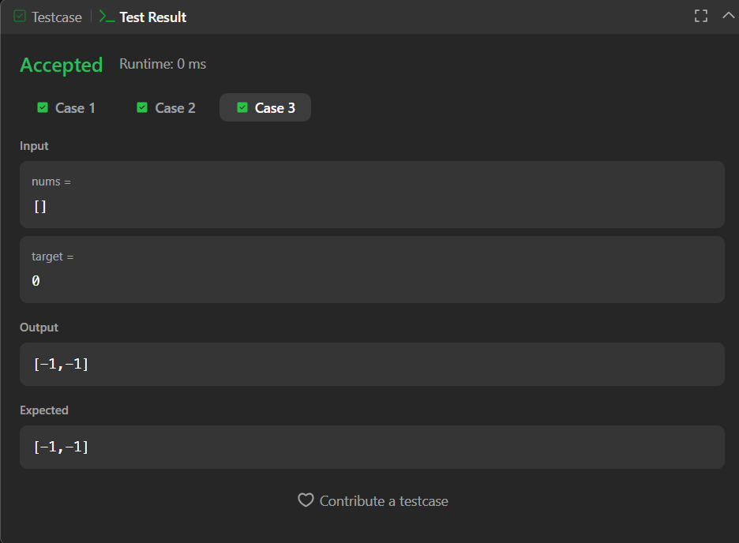

# Find First and Last Position of Element in Sorted Array

Efficient binary search solution to find the starting and ending position of a given target value in a sorted array.

---

## 📂 Files
- `Solution.java`

---

## 🧠 Concept Used
- Binary Search
- Modified Binary Search (First & Last Occurrence)
- Time Complexity Optimization
- Edge Case Handling

---

## 🚀 Approach
- Perform **two binary searches**:
  - One to find the **first occurrence** of the target
  - One to find the **last occurrence** of the target
- Update the search boundaries after finding the target instead of stopping immediately.
- Ensures **O(log n)** time complexity.

---

## 📸 Screenshot
  
  

---

## 👨‍💻 Author

**Sujal Patil**

  
  

