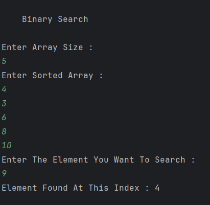

# Binary Search (Ceiling of a Number) in Java

A Java program that finds the **ceiling of a target element** in a sorted array using the Binary Search technique.  
The ceiling is the smallest element **greater than or equal to** the target.

---

## 📂 Files
- `Main.java`

---

## 🧠 Concept Used
- Binary Search (Ceiling Variant)
- Sorted array prerequisite
- Iterative approach
- Time Complexity: **O(log n)**
- Space Complexity: **O(1)**

---

## 📸 Screenshot

---

## 👨‍💻 Author

**Sujal Patil**

  
  

