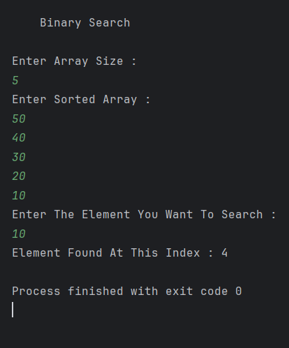

# Order-Agnostic Binary Search in Java

A Java implementation of **Order-Agnostic Binary Search** that efficiently searches for a target element in a sorted array, regardless of whether the array is sorted in ascending or descending order.

---

## 📂 Files
- `Main.java`

---

## 🧠 Concept Used
- Binary Search
- Order-Agnostic Search
- Divide and Conquer
- Index-based Search
- Time Complexity Optimization

---

## 📸 Screenshot

---

## 👨‍💻 Author

**Sujal Patil**

  
  

